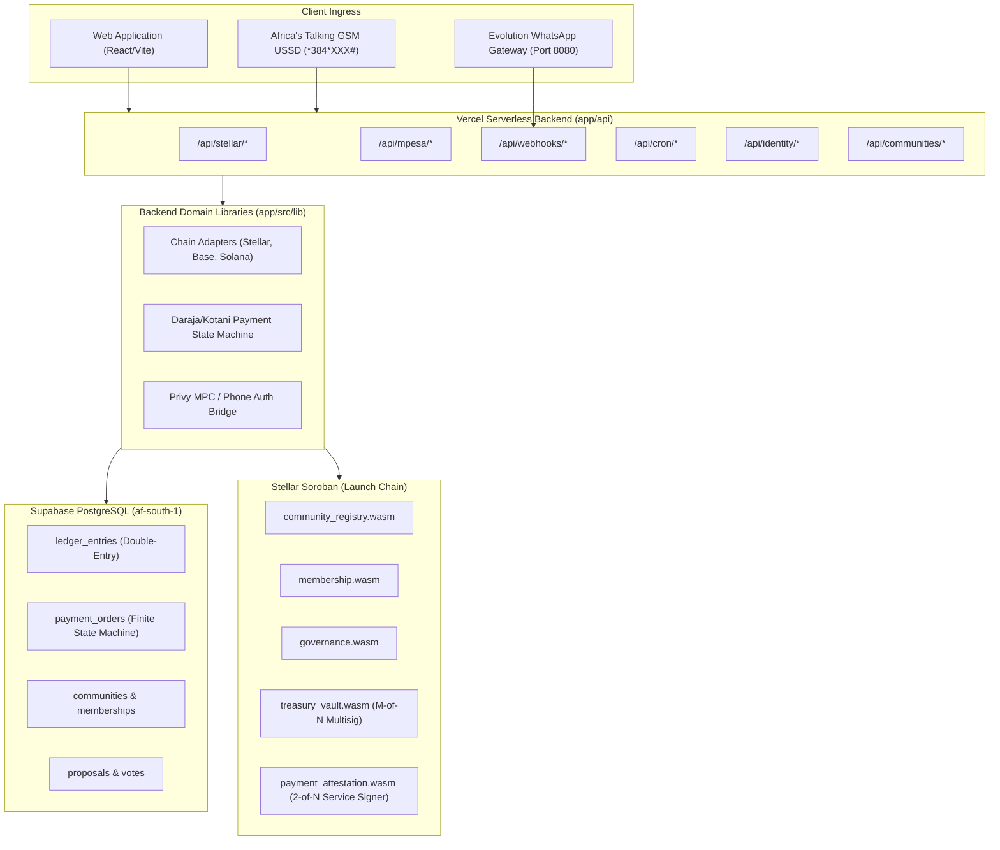

# Baraza Protocol — Backend Codebase Map (test-plan branch)

**Branch:** `test-plan`  
**Lead System Architect & Backend Engineer:** Simon Wandera  
**Date:** August 25, 2026  
**Document Purpose:** Complete structural mapping of all smart contracts, serverless API routes, chain adapters, payment state machines, and database migrations.

---

## Table of Contents
1. [Architecture Overview & Boundaries](#1-architecture-overview--boundaries)
2. [Smart Contracts Architecture](#2-smart-contracts-architecture)
3. [Serverless API Layer (`app/api/`)](#3-serverless-api-layer-appapi)
4. [Chain Adapters & Payment Pipeline (`app/src/lib/`)](#4-chain-adapters--payment-pipeline-appsrclib)
5. [Database Schema & Migrations (`supabase/migrations/`)](#5-database-schema--migrations-supabasemigrations)
6. [Conversational Bot & WhatsApp Gateway](#6-conversational-bot--whatsapp-gateway)

---

## 1. Architecture Overview & Boundaries

---

## 2. Smart Contracts Architecture

### 2.1 Stellar Soroban Suite (`contracts/stellar/`)
Compiled to WebAssembly (`wasm32-unknown-unknown`) targeting Stellar Soroban Protocol 20+:

#### 1. `community_registry/src/lib.rs` (154 lines)
- **Data Structures:**
  - `struct Community { community_id: String, name: String, admin: Address, created_at: u64 }`
  - `enum DataKey { Owner, Community(String) }`
- **Contract Functions:**
  - `initialize(env, owner: Address)`: One-time setup; requires `owner.require_auth()`; stores `DataKey::Owner`. Panics if already initialized.
  - `register(env, community_id: String, name: String, admin: Address)`: Owner-only; validates non-empty ID; checks duplicate in persistent storage; saves `Community` struct; emits event `(symbol_short!("register"), community_id)`.
  - `get(env, community_id: String) -> Option<Community>`: Reads persistent storage by `DataKey::Community(id)`.
  - `exists(env, community_id: String) -> bool`: Checks presence of community in persistent storage.
  - `update_admin(env, community_id: String, new_admin: Address)`: Admin-only transfer; requires `community.admin.require_auth()`; updates admin address in storage.
  - `set_owner(env, new_owner: Address)` & `owner(env) -> Address`: Owner authorization and query getters.
- **Test Coverage:** `test_register_and_get()`, `test_duplicate_registration_rejected()` (should panic).

#### 2. `membership/src/lib.rs` (188 lines)
- **Data Structures:**
  - `enum DataKey { Admin, Registry, Member(String, Address), Count(String) }`
- **Contract Functions:**
  - `initialize(env, admin: Address, registry: Address)`: Sets admin and the `community_registry` contract address for cross-contract membership verification.
  - `join(env, community_id: String, member: Address)`: Requires `member.require_auth()`; validates `Member(community_id, member)` is false; writes `Member = true`; increments `Count(community_id)` by 1; emits event `(symbol_short!("join"), community_id), member`.
  - `leave(env, community_id: String, member: Address)`: Requires `member.require_auth()`; checks membership exists; removes `Member` key; decrements `Count` safely; emits event `(symbol_short!("leave"), community_id), member`.
  - `kick(env, community_id: String, member: Address)`: Admin-only moderation; requires `admin.require_auth()`; removes member; decrements count; emits event `(symbol_short!("kick"), community_id), member`.
  - `is_member(env, community_id: String, member: Address) -> bool`: Boolean membership getter.
  - `member_count(env, community_id: String) -> u32`: Community member tally getter.
- **Test Coverage:** `test_join_leave_count()`, `test_double_join_rejected()` (should panic).

#### 3. `governance/src/lib.rs` (448 lines)
- **Data Structures:**
  - `enum ProposalStatus { Active, Passed, Failed, Tied, Executed, Cancelled }`
  - `struct Proposal { id: u64, community_id: String, title: String, description: String, proposer: Address, for_votes: u32, against_votes: u32, status: ProposalStatus, deadline: u64, executed: bool }`
  - `enum DataKey { Admin, Membership, VotingPeriod, NextId, Proposal(u64), Voted(u64, Address) }`
- **Constants:** `DEFAULT_VOTING_PERIOD = 7 * 24 * 60 * 60` (7 days in seconds).
- **Cross-Contract Integration:**
  - `require_member(&env, &community_id, &voter)`: Invokes deployed `membership` contract via `env.invoke_contract(&membership, &Symbol::new(env, "is_member"), args)`. Panics with `"not a member"` if voter is not verified.
- **Contract Functions:**
  - `initialize(env, admin, membership, voting_period: Option<u64>)`: Configures admin, membership address, voting period, and initializes `NextId = 0`.
  - `create_proposal(env, proposer, community_id, title, description) -> u64`: Requires `proposer.require_auth()`; validates `require_member`; creates `Proposal` with `deadline = timestamp + voting_period`; saves `Proposal(id)`; increments `NextId`; emits `(symbol_short!("proposed"), id)`.
  - `vote(env, voter, proposal_id, support: bool)`: Requires `voter.require_auth()`; checks `Voted(id, voter)` is false; validates `require_member`; verifies `ProposalStatus::Active` and `timestamp <= deadline`; increments `for_votes` (if true) or `against_votes` (if false); marks `Voted = true`; emits `(symbol_short!("voted"), proposal_id)`.
  - `finalize(env, proposal_id) -> ProposalStatus`: Verifies `timestamp > deadline`; resolves status to `Passed` (if for > against), `Failed` (if against > for), or `Tied` (if equal); emits `(symbol_short!("final"), proposal_id)`. Equal votes resolve strictly to `Tied` (non-executable deadlocks).
  - `mark_executed(env, proposal_id)`: Admin-only; verifies proposal is `Passed`; sets `status = Executed` and `executed = true`; emits `(symbol_short!("executed"), proposal_id)`.
  - `cancel(env, caller, proposal_id)`: Proposer or Admin only; sets `status = Cancelled`; emits `(symbol_short!("cancel"), proposal_id)`.
  - `get_proposal(id)`, `has_voted(id, voter)`, `set_voting_period(period)`, `voting_period()`.
- **Test Coverage:** `test_full_proposal_lifecycle()`, `test_double_vote_rejected()`, `test_tied_proposal_resolves_to_tied()`, `test_tied_proposal_cannot_be_executed()`, `test_failed_proposal_when_against_wins()`.

#### 4. `treasury_vault/src/lib.rs` (434 lines)
- **Data Structures:**
  - `struct Config { community_id: String, token: Address, signers: Vec<Address>, threshold: u32 }`
  - `struct Proposal { id: u64, to: Address, amount: i128, memo: String, approvals: Vec<Address>, executed: bool, created_at: u64 }`
  - `enum DataKey { Config, NextId, Proposal(u64) }`
- **Constants:** `MAX_SIGNERS = 20`.
- **Contract Functions:**
  - `initialize(env, community_id, token, signers, threshold)`: Validates `signers.len() > 0`, `signers.len() <= 20`, and `0 < threshold <= signers.len()`. Stores `Config` and `NextId = 0`.
  - `propose(env, proposer, to, amount, memo) -> u64`: Requires `proposer.require_auth()`; asserts proposer is in `signers`; asserts `amount > 0`; creates `Proposal` with `approvals = [proposer]` (proposer automatically counts as approval 1); increments `NextId`; emits `(symbol_short!("proposed"), id)`.
  - `approve(env, signer, proposal_id)`: Requires `signer.require_auth()`; asserts signer in `signers`; verifies `executed == false`; asserts signer not already in `approvals`; pushes signer to `approvals`; emits `(symbol_short!("approved"), proposal_id)`.
  - `execute(env, proposal_id)`: Verifies `executed == false`; verifies `approvals.len() >= threshold`; sets `executed = true`; invokes Soroban SAC token transfer `token::Client::new(&env, &token).transfer(&current_contract, &proposal.to, &proposal.amount)`; emits `(symbol_short!("executed"), proposal_id)`.
  - `deposit(env, from, amount)`: Requires `from.require_auth()`; asserts `amount > 0`; invokes token transfer from `from` to `current_contract`; emits `(symbol_short!("deposit"), (from, amount))`.
  - `balance(env) -> i128`: Queries token contract balance of the treasury vault address.
  - `get_proposal(id)`, `get_config()`.
- **Test Coverage:** `test_full_multisig_flow_executes_token_transfer()`, `test_execute_below_threshold_rejected()`, `test_double_approval_by_same_signer_rejected()`, `test_propose_by_non_signer_rejected()`, `test_approve_by_non_signer_rejected()`, `test_execute_twice_rejected()`, `test_propose_non_positive_amount_rejected()`, `test_deposit_increases_balance()`, `test_initialize_threshold_above_signer_count_rejected()`, `test_initialize_twice_rejected()`.

#### 5. `payment_attestation/src/lib.rs` (151 lines)
- **Data Structures:**
  - `struct PaymentRecord { tx_hash: BytesN<32>, community_id: String, amount: i128, payer: Address, ledger: u32, attested_at: u64 }`
  - `enum DataKey { Admin, Payment(BytesN<32>) }`
- **Contract Functions:**
  - `initialize(env, admin: Address)`: One-time setup; requires `admin.require_auth()`; stores `DataKey::Admin`.
  - `attest(env, tx_hash: BytesN<32>, community_id: String, amount: i128, payer: Address, ledger: u32) -> PaymentRecord`: Admin-only; requires `admin.require_auth()`; validates `amount > 0`; checks `Payment(tx_hash)` does not already exist (deduplication); creates `PaymentRecord` with `attested_at = timestamp`; stores record; emits event `(symbol_short!("attested"), tx_hash), record`.
  - `get_payment(env, tx_hash: BytesN<32>) -> Option<PaymentRecord>`: Queries persistent storage for payment proof.
  - `has_payment(env, tx_hash: BytesN<32>) -> bool`: Boolean attestation check.
  - `admin()`, `set_admin(new_admin)`.
- **Test Coverage:** `test_attest_and_lookup()`, `test_duplicate_rejected()`.

### 2.2 Base EVM & Aragon OSx Contracts (`contracts/evm/`)
Targeting Base Mainnet (`8453`) and Base Sepolia (`84532`):
- **`Manager.sol` (`0x3ac0e64fe2931f8e082c6bb29283540de9b5371c`):** Factory contract deploying DAO instances.
- **`Gov.sol` / `Token.sol`:** Timelocked governance governor and non-transferable Soulbound voting token.

### 2.3 Solana Anchor Contracts (`contracts/solana/`)
- Frozen/paused state (ADR-002) pending Phase 2 re-activation for high-frequency micro-voting.

---

## 3. Serverless API Layer (`app/api/`)

The repository contains 26 serverless routes running under Vercel Edge / Node.js runtimes:

### 3.1 Payment & Settlement Routes
1. **`api/stellar/create-payment-intent.ts`:**
   - **Method:** `POST` | **Runtime:** `nodejs`
   - **Function:** Signs an HMAC-SHA256 payment intent token using `STELLAR_INTENT_SECRET`; creates `payment_orders` record in `PENDING` state.
2. **`api/stellar/verify-payment.ts`:**
   - **Method:** `POST` | **Runtime:** `nodejs`
   - **Function:** Cross-checks payment order state against Soroban `payment_attestation` contract.
3. **`api/mpesa/transaction-status.ts`:**
   - **Method:** `POST` | **Runtime:** `nodejs`
   - **Function:** Initiates independent Safaricom Daraja Transaction Status Query (Invariant I2b) using Initiator Security Credentials; advances order state to `STATUS_QUERY_SENT`.
4. **`api/mpesa/status-result.ts`:**
   - **Method:** `POST` | **Runtime:** `nodejs`
   - **Function:** Asynchronous callback handler for Daraja status queries. Authenticated via `MPESA_STATUS_RESULT_PATH_SECRET` and CIDR IP validation (`196.201.214.0/24`, `196.201.213.0/24`, `196.13.100.0/24`). Advances state to `ATTESTATION_SUBMITTED` upon `ResultCode === 0`.
5. **`api/mpesa/status-timeout.ts`:**
   - **Method:** `POST` | **Runtime:** `nodejs`
   - **Function:** Handles query timeouts from Safaricom; schedules retry or escalates order.
6. **`api/mpesa/simulate.ts`:**
   - **Method:** `POST` | **Runtime:** `nodejs`
   - **Function:** Development-only STK simulator. Explicitly disabled in production (`MPESA_SIMULATOR_ENABLED=false`).
7. **`api/payments/kotani.ts` & `api/payments/minisend.ts`:**
   - **Method:** `POST` | **Runtime:** `nodejs`
   - **Function:** Proxy dispatchers for partner mobile money rails.
8. **`api/payments/brza-membership.ts` & `reconcile-brza-membership.ts`:**
   - **Method:** `POST` | **Runtime:** `nodejs`
   - **Function:** Manages BRZA token membership fee calculations and settlement.

### 3.2 Webhook Ingress Routes
9. **`api/webhooks/africastalking.ts`:**
   - **Method:** `POST` | **Runtime:** `edge`
   - **Function:** Ingress for Africa's Talking SMS notifications and USSD session steps.
10. **`api/webhooks/kotani.ts`:**
    - **Method:** `POST` | **Runtime:** `nodejs`
    - **Function:** Ingress for Kotani Pay payment completion callbacks.

### 3.3 Reconciliation & Background Tasks (`api/cron/`)
11. **`api/cron/promote-orders.ts`:**
    - **Method:** `GET` / `POST` | **Runtime:** `nodejs` | **Auth:** `CRON_SECRET`
    - **Function:** Scans `payment_orders` in `STATUS_QUERY_SENT` / `ATTESTATION_SUBMITTED` and executes on-chain attestations via `stellar-mint.ts`.
12. **`api/cron/settle-retro-allocations.ts`:**
    - **Method:** `GET` / `POST` | **Runtime:** `nodejs` | **Auth:** `CRON_SECRET`
    - **Function:** Settles periodic community retro-funding rounds.

### 3.4 Community & Identity Routes
13. **`api/communities/index.ts`:** List/create community records.
14. **`api/communities/retro-rounds.ts`, `retro-ballot.ts`, `retro-allocations.ts`, `retro-settle.ts`:** Quadratic retro-funding allocations.
15. **`api/identity/initiate-claim.ts` & `verify-claim.ts`:** Identity verification handshakes.
16. **`api/membership/activate.ts`:** Direct membership activation gate.
17. **`api/payment-orders/status.ts`, `streak.ts`, `streak-batch.ts`:** Member contribution streak counters.
18. **`api/ussd/index.ts`:** USSD text session state machine.
19. **`api/agent/chat.ts` & `api/akili/filings.ts`:** AI guidance engine proxy.

---

## 4. Chain Adapters & Payment Pipeline (`app/src/lib/`)

### 4.1 Polymorphic Chain Adapters (`app/src/lib/adapters/`)
- **`IChainAdapter.ts`:** Standard TypeScript interface for `createCommunity()`, `registerMember()`, `createProposal()`, `castVote()`, `initTreasury()`, `executeTreasury()`.
- **`StellarAdapter.ts`:** Concrete implementation invoking Soroban contracts via `@stellar/stellar-sdk` and RPC clients.
- **`BaseAdapter.ts`:** EVM implementation interacting with Aragon OSx contracts via `ethers` / `viem`.
- **`SolanaAdapter.ts`:** Anchor RPC client (stubbed/paused).

### 4.2 Payment State Machine (`app/src/lib/payments/`)
- **`daraja.ts`:** Safaricom Daraja OAuth client, STK Push dispatcher, and Transaction Status Query builder.
- **`state-machine.ts`:** Enforces the 5-state lifecycle:
  $$\text{PENDING} \longrightarrow \text{PROVIDER\_CONFIRMED} \longrightarrow \text{STATUS\_QUERY\_SENT} \longrightarrow \text{ATTESTATION\_SUBMITTED} \longrightarrow \text{MEMBERSHIP\_ACTIVE}$$
- **`idempotency.ts`:** Computes deterministic SHA256 idempotency keys.

---

## 5. Database Schema & Migrations (`supabase/migrations/`)

| Migration File | Key Schema Elements & Tables Managed |
| :--- | :--- |
| **`001_communities_governance_columns.sql`** | Adds `governance_type`, `voting_duration`, and chain designation to `communities`. |
| **`002_payment_orders.sql`** | Creates `payment_orders` table with state enums, amounts, currency, and provider references. |
| **`003_payment_attestations.sql`** | Creates `payment_attestations` recording on-chain transaction hashes. |
| **`004_memberships.sql`** | Creates `memberships` table linking `user_id`, `community_id`, and `role`. |
| **`005_stellar_settlements.sql`** | Stores Stellar transaction hashes, ledger sequence numbers, and stroop amounts. |
| **`006_bounties_security_stellar.sql`** | Manages community bounty vaults and security controls. |
| **`007_enable_evm_community_rails.sql`** | Adds EVM contract address columns to communities. |
| **`008_bounty_access_reward_token.sql`** | Configures token distribution rewards for bounties. |
| **`009_membership_payment_order_unique.sql`** | Unique constraint ensuring one active payment order per membership cycle. |
| **`010_proposals_votes_schema_gaps.sql`** | DDL for `proposals` and `votes` tables with quorum calculations. |
| **`011_fix_payment_orders_rls.sql`** | Secures `payment_orders` with Supabase Row-Level Security. |
| **`012_communities_rls.sql`** | Enforces RLS on `communities` (public read, admin write). |
| **`013_votes_block_migration_double_vote.sql`** | Unique constraint `(proposal_id, voter_address)` blocking double-votes. |
| **`014_votes_lock_migration_chain.sql`** | Locks votes to the designated community blockchain network. |
| **`016_votes_weight_positive_check.sql`** | Check constraint ensuring `voting_weight > 0`. |
| **`017_payment_orders_metadata.sql`** | JSONB metadata field on `payment_orders` for provider debug logs. |
| **`018_ussd_monitoring.sql`** | Logs USSD session performance and drop-off metrics. |
| **`019_retro_rounds.sql` – `021_retro_rounds_opened_by.sql`** | Quadratic retro-funding round management. |
| **`022_identity_links.sql`** | Maps Privy DID identifiers to hashed phone numbers. |
| **`023_payment_orders_add_status_query_states.sql`** | Adds `STATUS_QUERY_SENT` and `ATTESTATION_SUBMITTED` to order status enums. |
| **`026_leverage_foundation.sql`** | Financial leverage and credit scoring data models. |

---

## 6. Conversational Bot & WhatsApp Gateway

- **Evolution API Integration:** Runs in a separate Docker container stack (`evolution-api/`) with PostgreSQL and Redis.
- **Bot FSM Engine:** Pure TypeScript decision function `processTurn()` decoupled from I/O messaging transports (ADR-007).
