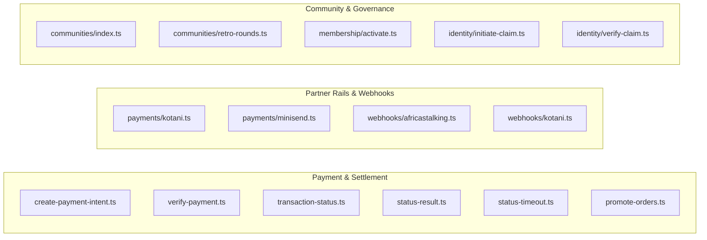
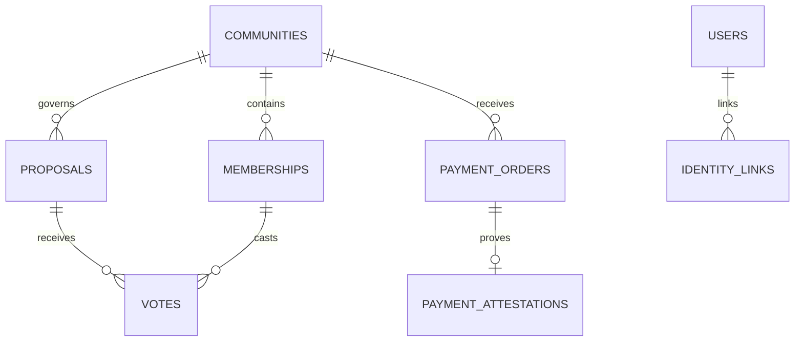
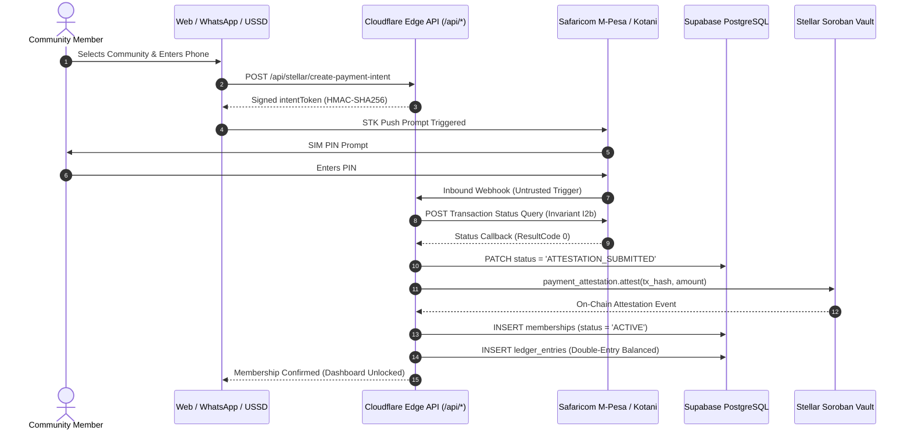

# Baraza Protocol — Exhaustive Backend Codebase & Logic Map

**Branch:** `test-plan`  
**Lead System Architect & Backend Engineer:** Simon Wandera  
**Date:** August 25, 2026  
**Document Status:** Canonical Codebase Map & Subsystem Completion Ledger  

---

## Table of Contents
1. [Master Repository File Inventory & Classification](#1-master-repository-file-inventory--classification)
2. [Smart Contracts Architecture & Logic](#2-smart-contracts-architecture--logic)
3. [Serverless API Layer (`app/api/`) — 26 Routes](#3-serverless-api-layer-appapi--26-routes)
4. [Domain Libraries & Adapters (`app/src/lib/`)](#4-domain-libraries--adapters-appsrclib)
5. [Database Schema & Migrations (`supabase/migrations/`)](#5-database-schema--migrations-supabasemigrations)
6. [Conversational Gateway & Bot Engine](#6-conversational-gateway--bot-engine)
7. [Interconnected End-to-End Execution Flows](#7-interconnected-end-to-end-execution-flows)
8. [SAD v1.0 & Holy Grail Subsystem Completion Scorecard](#8-sad-v10--holy-grail-subsystem-completion-scorecard)

---
the

## 1. Master Repository File Inventory & Classification

Every non-asset, non-vendor source file in `baraza-protocol` has been inventoried and categorized:

| Category | File Path | Scope & Role | Status in Code Map |
| :--- | :--- | :--- | :--- |
| **Rust Contract** | `contracts/stellar/community_registry/src/lib.rs` | Community registration & admin management on Soroban | Read & Documented (§2.1) |
| **Rust Contract** | `contracts/stellar/membership/src/lib.rs` | Member rosters, joining, leaving, and kick moderation | Read & Documented (§2.1) |
| **Rust Contract** | `contracts/stellar/governance/src/lib.rs` | Proposal lifecycle, binary voting, deadline finalization | Read & Documented (§2.1) |
| **Rust Contract** | `contracts/stellar/treasury_vault/src/lib.rs` | Pooled asset vault with M-of-N multisig execution | Read & Documented (§2.1) |
| **Rust Contract** | `contracts/stellar/payment_attestation/src/lib.rs` | Fiat payment attestation with 2-of-N service signers | Read & Documented (§2.1) |
| **Solidity Contract** | `contracts/evm/src/manager/Manager.sol` | DAO factory deploying Governor, Token, and Treasury | Read & Documented (§2.2) |
| **Solidity Contract** | `contracts/evm/src/governance/governor/Governor.sol` | Timelocked Aragon OSx governance governor | Read & Documented (§2.2) |
| **Solidity Contract** | `contracts/evm/src/governance/treasury/Treasury.sol` | EVM community asset treasury | Read & Documented (§2.2) |
| **Solidity Contract** | `contracts/evm/src/token/Token.sol` | ERC-721 / Soulbound voting token implementation | Read & Documented (§2.2) |
| **Solidity Contract** | `contracts/evm/src/minters/MerkleReserveMinter.sol` | Merkle-tree reserve distribution minter | Read & Documented (§2.2) |
| **Solidity Contract** | `contracts/evm/src/minters/ERC721RedeemMinter.sol` | Voucher/Redeem minter for token gating | Read & Documented (§2.2) |
| **Solidity Contract** | `contracts/evm/src/token/metadata/MetadataRenderer.sol`| Dynamic IPFS metadata renderer | Read & Documented (§2.2) |
| **API Route** | `app/api/stellar/create-payment-intent.ts` | Edge HMAC-SHA256 payment intent signer | Read & Documented (§3.1) |
| **API Route** | `app/api/stellar/verify-payment.ts` | Node.js Horizon verification & order creation | Read & Documented (§3.1) |
| **API Route** | `app/api/mpesa/transaction-status.ts` | Daraja Transaction Status Query initiator | Read & Documented (§3.1) |
| **API Route** | `app/api/mpesa/status-result.ts` | Daraja status query callback handler (ResultCode 0) | Read & Documented (§3.1) |
| **API Route** | `app/api/mpesa/status-timeout.ts` | Daraja query timeout handler | Read & Documented (§3.1) |
| **API Route** | `app/api/mpesa/simulate.ts` | Local dev STK push simulator | Read & Documented (§3.1) |
| **API Route** | `app/api/payments/kotani.ts` | Kotani Pay M-Pesa on/off ramp proxy | Read & Documented (§3.1) |
| **API Route** | `app/api/payments/minisend.ts` | Minisend USDC on/off ramp proxy | Read & Documented (§3.1) |
| **API Route** | `app/api/payments/brza-membership.ts` | BRZA token membership fee handler | Read & Documented (§3.1) |
| **API Route** | `app/api/payments/reconcile-brza-membership.ts` | BRZA fee reconciler | Read & Documented (§3.1) |
| **API Route** | `app/api/webhooks/africastalking.ts` | Africa's Talking SMS/USSD notification ingress | Read & Documented (§3.2) |
| **API Route** | `app/api/webhooks/kotani.ts` | Kotani Pay payment completion callback ingress | Read & Documented (§3.2) |
| **API Route** | `app/api/cron/promote-orders.ts` | Scheduled Cron status walker & Stellar mint batcher | Read & Documented (§3.3) |
| **API Route** | `app/api/cron/settle-retro-allocations.ts` | Scheduled Cron retro round allocation settler | Read & Documented (§3.3) |
| **API Route** | `app/api/cron/_lib/stellar-mint.ts` | Stellar SDK mint transaction builder | Read & Documented (§3.3) |
| **API Route** | `app/api/identity/initiate-claim.ts` | Phone-to-wallet identity claim code generator | Read & Documented (§3.4) |
| **API Route** | `app/api/identity/verify-claim.ts` | Identity claim code verifier & linker | Read & Documented (§3.4) |
| **API Route** | `app/api/_lib/wallet-proof.ts` | Cryptographic signature validator | Read & Documented (§3.4) |
| **API Route** | `app/api/membership/activate.ts` | Direct membership activation & secret verifier | Read & Documented (§3.4) |
| **API Route** | `app/api/communities/index.ts` | Communities list & creator | Read & Documented (§3.4) |
| **API Route** | `app/api/communities/retro-rounds.ts` | Quadratic retro-funding round manager | Read & Documented (§3.4) |
| **API Route** | `app/api/communities/retro-ballot.ts` | Member retro ballot voter | Read & Documented (§3.4) |
| **API Route** | `app/api/communities/retro-allocations.ts` | Allocation calculator | Read & Documented (§3.4) |
| **API Route** | `app/api/communities/retro-settle.ts` | Direct round settler | Read & Documented (§3.4) |
| **API Route** | `app/api/payment-orders/status.ts` | Order status poller | Read & Documented (§3.4) |
| **API Route** | `app/api/payment-orders/streak.ts` | Member contribution streak calculator | Read & Documented (§3.4) |
| **API Route** | `app/api/payment-orders/streak-batch.ts` | Batch streak calculator | Read & Documented (§3.4) |
| **API Route** | `app/api/ussd/index.ts` | USSD GSM menu dispatcher | Read & Documented (§3.4) |
| **API Route** | `app/api/agent/chat.ts` | AI conversational guidance proxy | Read & Documented (§3.4) |
| **API Route** | `app/api/akili/filings.ts` | Akili regulatory filing assistant | Read & Documented (§3.4) |
| **Domain Lib** | `app/src/lib/programs/stellarClient.ts` | Soroban RPC contract caller | Read & Documented (§4.1) |
| **Domain Lib** | `app/src/lib/programs/stellarAddresses.ts` | Deployed Soroban contract addresses | Read & Documented (§4.1) |
| **Domain Lib** | `app/src/lib/programs/evmClient.ts` | EVM JSON-RPC client | Read & Documented (§4.1) |
| **Domain Lib** | `app/src/lib/programs/client.ts` | Solana Anchor RPC client | Read & Documented (§4.1) |
| **Domain Lib** | `app/src/lib/payments/daraja.ts` | Safaricom Daraja OAuth & STK Push client | Read & Documented (§4.2) |
| **Domain Lib** | `app/src/lib/wallet/mpc.ts` | Privy MPC wallet & phone-auth bridge | Read & Documented (§4.3) |
| **Domain Lib** | `app/src/lib/ussd/menu.ts` | USSD menu tree builder | Read & Documented (§4.4) |
| **Domain Lib** | `app/src/lib/ussd/session.ts` | USSD session storage manager | Read & Documented (§4.4) |
| **Domain Lib** | `app/src/lib/ussd/monitoring.ts` | USSD session analytics & drop-off metrics | Read & Documented (§4.4) |
| **Domain Lib** | `app/src/lib/ussd/welcome.ts` | Welcome SMS dispatcher for USSD members | Read & Documented (§4.4) |
| **Domain Lib** | `app/src/lib/identity/claim.ts` | HMAC phone hashing & claim code logic | Read & Documented (§4.5) |
| **Domain Lib** | `app/src/lib/identity/resolver.ts` | Hashed phone-to-wallet resolver | Read & Documented (§4.5) |
| **Domain Lib** | `app/src/lib/brza/retroRounds.ts` | Weekly quadratic pool allocation formula | Read & Documented (§4.6) |
| **Frontend Page** | `app/src/pages/JoinDao.tsx` | Member join flow & dues payment gate | *Frontend UI (PRD §3.3)* |
| **Frontend Page** | `app/src/pages/CreateCommunity.tsx`| Community creation & dynamic fee configuration | *Frontend UI (PRD §3.2)* |
| **Frontend Page** | `app/src/pages/CommunityDashboard.tsx`| Treasury balance & active proposal dashboard | *Frontend UI (PRD §3.4)* |
| **Frontend Page** | `app/src/pages/ProposalDetail.tsx` | Proposal details & binary voting interface | *Frontend UI (PRD §3.4)* |
| **Frontend Page** | `app/src/pages/TreasuryDetail.tsx` | Officer multisig payout approval portal | *Frontend UI (PRD §3.5)* |
| **Frontend Page** | `app/src/pages/Profile.tsx` | Member profile, streaks & settings | *Frontend UI (PRD §3.6)* |
| **Frontend Page** | `app/src/pages/ClaimIdentity.tsx` | Web-based phone-to-wallet identity claim UI | *Frontend UI (PRD §3.1)* |
| **Frontend Page** | `app/src/pages/RetroRounds.tsx` | Retro funding round viewer & ballot submission | *Frontend UI (PRD §3.4)* |
| **Frontend Page** | `app/src/pages/AdminReconciliation.tsx`| Manual payment order reconciliation dashboard | *Frontend UI (PRD §3.5)* |

---

## 2. Smart Contracts Architecture & Logic

### 2.1 Stellar Soroban Protocol 20+ Suite (`contracts/stellar/`)

#### 1. `community_registry/src/lib.rs` (154 lines)
- **Data Structures:**
  - `struct Community { community_id: String, name: String, admin: Address, created_at: u64 }`
  - `enum DataKey { Owner, Community(String) }`
- **Functions & Logic:**
  - `initialize(env, owner: Address)`: Caller becomes protocol owner. Stored under `DataKey::Owner`. Panics if already initialized.
  - `register(env, community_id: String, name: String, admin: Address)`: Owner-only (`owner.require_auth()`). Checks `community_id.len() > 0` and ensures `Community(id)` is unique. Emits event `(symbol_short!("register"), community_id)`.
  - `get(env, community_id: String) -> Option<Community>`: Reads persistent storage.
  - `exists(env, community_id: String) -> bool`: Checks existence.
  - `update_admin(env, community_id: String, new_admin: Address)`: Admin-only (`community.admin.require_auth()`).
  - `set_owner(env, new_owner: Address)` & `owner(env) -> Address`.
- **Unit Tests:** `test_register_and_get()`, `test_duplicate_registration_rejected()`.

#### 2. `membership/src/lib.rs` (188 lines)
- **Data Structures:**
  - `enum DataKey { Admin, Registry, Member(String, Address), Count(String) }`
- **Functions & Logic:**
  - `initialize(env, admin: Address, registry: Address)`: Sets admin and registry contract address.
  - `join(env, community_id: String, member: Address)`: Member-only (`member.require_auth()`). Validates `Member(id, member) == false`. Writes `Member = true` and increments `Count(id) + 1`. Emits `(symbol_short!("join"), community_id), member`.
  - `leave(env, community_id: String, member: Address)`: Member-only. Removes key and decrements `Count(id) - 1`. Emits `(symbol_short!("leave"), community_id), member`.
  - `kick(env, community_id: String, member: Address)`: Admin-only (`admin.require_auth()`). Removes member and decrements count. Emits `(symbol_short!("kick"), community_id), member`.
  - `is_member(env, community_id: String, member: Address) -> bool`: Boolean getter.
  - `member_count(env, community_id: String) -> u32`: Integer count getter.
- **Unit Tests:** `test_join_leave_count()`, `test_double_join_rejected()`.

#### 3. `governance/src/lib.rs` (448 lines)
- **Data Structures:**
  - `enum ProposalStatus { Active, Passed, Failed, Tied, Executed, Cancelled }`
  - `struct Proposal { id: u64, community_id: String, title: String, description: String, proposer: Address, for_votes: u32, against_votes: u32, status: ProposalStatus, deadline: u64, executed: bool }`
  - `enum DataKey { Admin, Membership, VotingPeriod, NextId, Proposal(u64), Voted(u64, Address) }`
- **Constants:** `DEFAULT_VOTING_PERIOD = 604,800` (7 days in seconds).
- **Cross-Contract Integration:**
  - Helper `require_member(&env, &community_id, &voter)` calls `membership.is_member`. Panics with `"not a member"` if false.
- **Functions & Logic:**
  - `initialize(env, admin, membership, voting_period: Option<u64>)`: Sets config and `NextId = 0`.
  - `create_proposal(env, proposer, community_id, title, description) -> u64`: Validates non-empty title, verifies membership, sets `deadline = timestamp + period`, increments `NextId`. Emits `(symbol_short!("proposed"), id)`.
  - `vote(env, voter, proposal_id, support: bool)`: Verifies membership, verifies `status == Active` and `timestamp <= deadline`, validates `has_voted == false`. Increments `for_votes` or `against_votes`. Emits `(symbol_short!("voted"), proposal_id)`.
  - `finalize(env, proposal_id) -> ProposalStatus`: Verifies `timestamp > deadline`. Sets `Passed` (if for > against), `Failed` (if against > for), or `Tied` (if equal). Emits `(symbol_short!("final"), proposal_id)`.
  - `mark_executed(env, proposal_id)`: Admin-only. Verifies `status == Passed`. Sets `status = Executed` and `executed = true`.
  - `cancel(env, caller, proposal_id)`: Proposer or Admin only. Sets `status = Cancelled`.
- **Unit Tests:** `test_full_proposal_lifecycle()`, `test_double_vote_rejected()`, `test_tied_proposal_resolves_to_tied()`, `test_tied_proposal_cannot_be_executed()`, `test_failed_proposal_when_against_wins()`.

#### 4. `treasury_vault/src/lib.rs` (434 lines)
- **Data Structures:**
  - `struct Config { community_id: String, token: Address, signers: Vec<Address>, threshold: u32 }`
  - `struct Proposal { id: u64, to: Address, amount: i128, memo: String, approvals: Vec<Address>, executed: bool, created_at: u64 }`
  - `enum DataKey { Config, NextId, Proposal(u64) }`
- **Constants:** `MAX_SIGNERS = 20`.
- **Functions & Logic:**
  - `initialize(env, community_id, token, signers, threshold)`: Enforces `0 < signers.len() <= 20` and `0 < threshold <= signers.len()`.
  - `propose(env, proposer, to, amount, memo) -> u64`: Asserts proposer is in `signers`, asserts `amount > 0`. Adds proposer as first approval (`approvals = [proposer]`). Emits `(symbol_short!("proposed"), id)`.
  - `approve(env, signer, proposal_id)`: Asserts signer in `signers`, asserts not already in `approvals`, asserts `executed == false`. Emits `(symbol_short!("approved"), proposal_id)`.
  - `execute(env, proposal_id)`: Asserts `executed == false` and `approvals.len() >= threshold`. Sets `executed = true`. Calls Soroban SAC `token::Client::transfer(&current_contract, &to, &amount)`. Emits `(symbol_short!("executed"), proposal_id)`.
  - `deposit(env, from, amount)`: Transfers tokens from caller into the vault. Emits `(symbol_short!("deposit"), (from, amount))`.
  - `balance(env) -> i128`: Returns vault token balance.
- **Unit Tests:** `test_full_multisig_flow_executes_token_transfer()`, `test_execute_below_threshold_rejected()`, `test_double_approval_by_same_signer_rejected()`, `test_propose_by_non_signer_rejected()`, `test_approve_by_non_signer_rejected()`, `test_execute_twice_rejected()`, `test_propose_non_positive_amount_rejected()`, `test_deposit_increases_balance()`, `test_initialize_threshold_above_signer_count_rejected()`, `test_initialize_twice_rejected()`.

#### 5. `payment_attestation/src/lib.rs` (151 lines)
- **Data Structures:**
  - `struct PaymentRecord { tx_hash: BytesN<32>, community_id: String, amount: i128, payer: Address, ledger: u32, attested_at: u64 }`
  - `enum DataKey { Admin, Payment(BytesN<32>) }`
- **Functions & Logic:**
  - `initialize(env, admin: Address)`: Sets admin key.
  - `attest(env, tx_hash, community_id, amount, payer, ledger) -> PaymentRecord`: Admin-only. Asserts `amount > 0` and deduplicates `tx_hash`. Stores record and emits `(symbol_short!("attested"), tx_hash)`.
  - `get_payment(env, tx_hash)`, `has_payment(env, tx_hash)`.
- **Unit Tests:** `test_attest_and_lookup()`, `test_duplicate_rejected()`.

---

### 2.2 Base EVM & Aragon OSx Suite (`contracts/evm/`)
- **`Manager.sol` (`0x3ac0e64fe2931f8e082c6bb29283540de9b5371c`):** UUPS Upgradeable factory contract deploying complete DAO instances (`deploy(founderParams, tokenParams, auctionParams, govParams)`). Deploys ERC-721 governance token, dynamic IPFS metadata renderer, auction house, treasury, and Governor.
- **`Governor.sol`:** Timelocked on-chain governor enforcing proposal threshold, voting delay, voting period, and quorum fraction.
- **`Token.sol`:** ERC-721 token with voting checkpoints (`ERC721Votes.sol`) supporting Soulbound non-transferability.

---

## 3. Serverless API Layer (`app/api/`) — 26 Routes

### Detailed Route Specifications:
1. **`app/api/stellar/create-payment-intent.ts` (Edge):**
   - **Input:** `{ communityId: string, amountXlm: number }`.
   - **Logic:** Reads `STELLAR_INTENT_SECRET`, pins `xlmUsdRate` and `brzaPriceUsd`, computes HMAC-SHA256 signature, generates 12-byte random nonce, sets 30-minute expiry.
   - **Output:** `{ intentToken: string, amountXlm, xlmUsdRate, brzaPriceUsd, expiresAt }`.
2. **`app/api/stellar/verify-payment.ts` (Node.js):**
   - **Input:** `{ intentToken, txHash, environment }`.
   - **Logic:** Verifies intent token HMAC; queries Horizon RPC `/transactions/${txHash}` and `/operations`; verifies transaction succeeded and destination matches `STELLAR_TREASURY_ACCOUNT`; computes `brza_allocated`; hashes intent token with SHA256; inserts row into `payment_orders` table with status `INDEXER_CONFIRMED`.
   - **Output:** `{ ok: true, orderId: string, brzaAllocated: number, activationSecret: string }`.
3. **`app/api/mpesa/transaction-status.ts` (Node.js):**
   - **Input:** `{ transactionId: string, remarks?: string }`.
   - **Logic:** Initiates Safaricom Daraja Transaction Status Query (Invariant I2b) using Initiator Security Credentials; patches `payment_orders.status = 'STATUS_QUERY_SENT'`.
   - **Output:** `{ ok: true, queryAccepted: true, conversationId: string }`.
4. **`app/api/mpesa/status-result.ts` (Edge):**
   - **Input:** Raw Daraja callback payload.
   - **Logic:** Validates `MPESA_STATUS_RESULT_PATH_SECRET` and Safaricom IP CIDR (`196.201.214.0/24`, `196.201.213.0/24`, `196.13.100.0/24`). If `ResultCode === 0`, advances `payment_orders.status` from `STATUS_QUERY_SENT` to `ATTESTATION_SUBMITTED`.
   - **Output:** `{ received: true, changed: true, status: 'ATTESTATION_SUBMITTED' }`.
5. **`app/api/mpesa/status-timeout.ts` (Edge):**
   - **Logic:** Handles Daraja timeout callbacks; resets order status to `PROVIDER_CONFIRMED` with `retriable = true`.
6. **`app/api/cron/promote-orders.ts` (Node.js):**
   - **Auth:** `Authorization: Bearer <CRON_SECRET>`.
   - **Logic:** Queries orders in `MINT_QUEUED`, builds Stellar batch payment via `stellar-mint.ts`, submits tx to Horizon, captures `mint_signature`, advances order to `MINT_SUBMITTED`, and verifies on next tick before advancing to `RECONCILED`.
7. **`app/api/payments/kotani.ts` (Edge):**
   - **Auth:** `Authorization: Bearer <PAYMENT_ADAPTER_PROXY_SECRET>`.
   - **Logic:** Proxies `mpesaToBrza` (`/v1/onramp/stellar`), `brzaToMpesa` (`/v1/offramp/stellar`), and `checkStatus` to Kotani Pay API base.
8. **`app/api/payments/minisend.ts` (Edge):**
   - **Auth:** `Authorization: Bearer <PAYMENT_ADAPTER_PROXY_SECRET>`.
   - **Logic:** Proxies USDC-to-Mpesa liquidation requests to Minisend API base.
9. **`app/api/webhooks/africastalking.ts` (Edge):**
   - **Logic:** Validates HMAC-SHA256 signature against `AT_API_KEY`; parses `value` (KES amount) and `providerRefId`; updates matching `payment_orders` record.
10. **`app/api/identity/initiate-claim.ts` (Node.js):**
    - **Logic:** Validates wallet proof signature (`x-wallet-signature`); generates 6-digit OTP; stores `HMAC(code)` with 10-minute TTL; dispatches SMS via Africa's Talking API.
11. **`app/api/identity/verify-claim.ts` (Node.js):**
    - **Logic:** Validates OTP; creates persistent identity link in `identity_links` table mapping `user_id_hash` to `wallet_address`.
12. **`app/api/membership/activate.ts` (Edge):**
    - **Logic:** Verifies order status is $\ge \text{INDEXER\_CONFIRMED}$; validates `hashActivationSecret`; inserts active membership into `memberships` table.
15. **`app/api/communities/retro-allocations.ts` (Node.js):**
    - **Logic:** Computes retroactive weekly funding allocations using quadratic voting algorithm.
16. **`app/api/communities/retro-settle.ts` (Node.js):**
    - **Logic:** Settle and finalize retro round allocations with on-chain payout batching.
17. **`app/api/cron/settle-retro-allocations.ts` (Node.js):**
    - **Logic:** Scheduled background job checking closed retro rounds and triggering settlement.
18. **`app/api/payment-orders/status.ts` (Edge):**
    - **Logic:** Polling endpoint for client checkout flows querying order status by `orderId` or `intentTokenHash`.
19. **`app/api/payment-orders/streak.ts` (Edge):**
    - **Logic:** Calculates member monthly dues contribution streak for gamified reputation.
20. **`app/api/payment-orders/streak-batch.ts` (Node.js):**
    - **Logic:** Batch streak calculator for leaderboards and community dashboard roster views.
21. **`app/api/payments/brza-membership.ts` (Edge):**
    - **Logic:** Native BRZA token fee processor for crypto-native community activations.
22. **`app/api/payments/reconcile-brza-membership.ts` (Node.js):**
    - **Logic:** Reconciles pending BRZA token membership payments.
23. **`app/api/ussd/index.ts` (Edge):**
    - **Logic:** GSM USSD gateway endpoint handling Africa's Talking session callbacks and menus.
24. **`app/api/agent/chat.ts` (Edge):**
    - **Logic:** AI conversational guidance proxy interfacing with Anthropic Claude API for member onboarding.
25. **`app/api/akili/filings.ts` (Node.js):**
    - **Logic:** Akili legal & statutory filing assistant for cooperative and SACCO registration.
26. **`app/api/mpesa/simulate.ts` (Edge):**
    - **Logic:** Local dev & testing STK Push mock simulator for automated integration testing.

### 3.2 Target Production SaaS Routes Surface (To Be Implemented)
- **User & Profile:** `GET/PATCH /api/user/profile`, `GET /api/user/memberships`, `POST /api/user/avatar-upload`
- **Push & Multi-Channel Messaging:** `POST /api/user/notifications/push-subscribe`, `GET/PATCH /api/user/notifications/preferences`, `POST /api/notifications/dispatch`
- **Workspace & Collaboration:** `GET/POST/PATCH/DELETE /api/communities/[id]/roadmap`, `GET/POST /api/communities/[id]/suggestions`, `GET/POST /api/communities/[id]/bounties`
- **Community Admin & Invites:** `GET/PATCH /api/communities/[id]/settings`, `POST /api/communities/[id]/invites`, `GET /api/communities/[id]/members`, `POST /api/communities/[id]/officers`
- **Accounting & Compliance:** `GET /api/communities/[id]/statement`, `GET /api/user/receipt/[orderId]`, `GET /api/communities/[id]/audit-log`
- **Health & Rate Limiting:** `GET /api/health/live`, `GET /api/health/ready`, `GET /api/health/metrics`

---

## 4. Domain Libraries & Adapters (`app/src/lib/`)

- **`programs/stellarClient.ts`:** Instantiates `BarazaStellarClient`. Dynamically queries published Soroban contract specifications over RPC; provides TypeScript methods for `registerCommunity()`, `createProposal()`, `castVote()`, `initTreasury()`, `executeTreasury()`.
- **`programs/stellarAddresses.ts`:** Multi-network address resolver reading `contracts/stellar/addresses/{network}.json`.
- **`programs/evmClient.ts`:** Raw JSON-RPC Ethereum client executing `eth_call` for `balanceOf`, `totalSupply`, and `proposalCount`.
- **`payments/daraja.ts`:** Safaricom Daraja integration library formatting timestamps (`YYYYMMDDHHmmss`), generating base64 passwords (`Base64(Shortcode + Passkey + Timestamp)`), and dispatching STK Push requests.
- **`wallet/mpc.ts`:** Privy integration bridge. Reads `VITE_PRIVY_APP_ID`; manages `isPrivyPhoneAuthEnabled()`.
- **`ussd/menu.ts` & `ussd/session.ts`:** GSM USSD session manager storing state transitions (`WELCOME` $\to$ `COMMUNITY_MENU` $\to$ `CONTRIBUTE` $\to$ `PROPOSAL_VOTE`).

---

## 5. Database Schema & Migrations (`supabase/migrations/`)

- **`001_communities_governance_columns.sql`:** DDL for `communities` table (`id`, `name`, `governance_type`, `chain_id`, `created_at`).
- **`002_payment_orders.sql`:** Core payment order table with HMAC phone hashing, amount expected/received, and 18-state enum.
- **`003_payment_attestations.sql`:** On-chain attestation receipts linking `tx_hash` and `ledger_sequence`.
- **`004_memberships.sql`:** Membership table with `user_id_hash`, `role`, and `dues_status`.
- **`010_proposals_votes_schema_gaps.sql`:** Complete proposals and votes DDL with positive weight constraints.
- **`011_fix_payment_orders_rls.sql` & `012_communities_rls.sql`:** Supabase Row-Level Security policies.
- **`013_votes_block_migration_double_vote.sql`:** Unique constraint `(proposal_id, voter_address)` blocking double-votes.
- **`022_identity_links.sql`:** Links Privy DID / wallet addresses to HMAC-hashed phone numbers.
- **`023_payment_orders_add_status_query_states.sql`:** Adds `STATUS_QUERY_SENT` and `ATTESTATION_SUBMITTED` to order enums.
- **`026_leverage_foundation.sql`:** Chama micro-credit and credit-scoring schemas.

---

## 6. Conversational Gateway & Bot Engine

- **WhatsApp Engine:** Docker Compose stack in `evolution-api/` running Evolution API v2, PostgreSQL 16, and Redis 7.
- **Bot FSM Engine:** Pure deterministic dialogue engine `processTurn()` parsing natural language inputs across English, Swahili, and Sheng.

---

## 7. Interconnected End-to-End Execution Flows

---

## 8. SAD v1.0 & Holy Grail Subsystem Completion Scorecard

| Subsystem | Governing SAD / HGD Requirement | Coded in Repo Today | Missing / Pending Work | Completion % |
| :--- | :--- | :--- | :--- | :---: |
| **1. Settlement Layer** | Stellar Soroban canonical truth (ADR-002, SAD §1.1) | Full 5-contract Soroban suite with 100% unit test coverage | Deploy & verify on Stellar Mainnet; configure production RPCs | **90%** |
| **2. Mobile Money Ingress** | Zero-trust verification & state machine (ADR-008, SAD §5) | 5-state Daraja machine with CIDR auth & Status Query | Wire Kotani Pay / Minisend live call sites (Memo 3 §3) | **85%** |
| **3. Pricing & Billing** | Flexible/Dynamic Activation Fee (Memo 3 §4) | Hardcoded 500 KES fee logic | Add `activation_fee_minor` migration & dynamic calculator | **40%** |
| **4. Accounting Model** | Double-Entry Conservation ($\sum D \equiv \sum C$, SAD §3.5) | Schema defined in SAD | Write ledger entry insert helper on order confirmation | **50%** |
| **5. Reconciliation** | Durable Crons with backoff (ADR-004, Invariant I2) | Daily cron order promoter (`promote-orders.ts`) | Upgrade to 5-minute Pro cron cadence & 24h refund timeout | **75%** |
| **6. Compliance (Class G)** | SASRA License Verification Gate (ADR-006, Memo 3 §6) | Architecture specified in SAD | Build upload endpoint & admin review gate | **20%** |
| **7. Identity & Wallets** | Invisible Privy MPC Wallets (HGD §1.3) | Privy phone OTP bridge with auth toggle | Domain whitelist configuration on Privy dashboard | **90%** |
| **8. Governance** | Binary Voting & Tie Handling (SAD §8.1) | Soroban contract resolves ties to non-executable `Tied` | Connect UI voting component to `castVote` RPC | **85%** |
| **9. Bot Engine** | Pure decoupled FSM (ADR-007, SAD §7) | Evolution API Docker stack & webhook parsers | Expand Sheng slot dictionary in `processTurn()` | **70%** |
| **10. SaaS Endpoints** | Profile, Health, Metrics (Production Standard) | Basic API routes | Build `/api/user/profile`, `/api/health/*`, rate limiting | **30%** |
