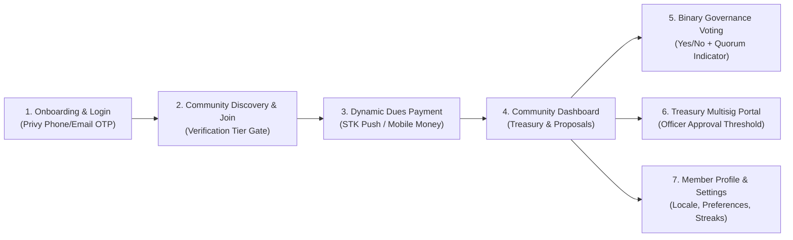

# Baraza Protocol — Frontend Integration Product Requirements Document (PRD)

**Target:** Web Application (`apps/web` / React 18 + Vite)  
**Lead System Architect & Backend Engineer:** Simon Wandera  
**Date:** August 25, 2026  
**Document Status:** Approved Reference Specification for Frontend Implementation  

---

## 1. Executive Summary & Architecture Boundary
This PRD defines the complete user-facing product requirements, screens, state machines, and API integration boundaries for the Baraza Protocol client application. The frontend exists to present an intuitive, jargon-free interface for community members and leaders across East Africa, abstracting blockchain complexity behind invisible Privy MPC wallets while reliably consuming the hardened Vercel serverless backend.

---

## 2. Core User Journeys & UI State Machines

---

## 3. Detailed Screen Specifications & Backend Contracts

### 3.1 Authentication & Invisible Wallet Onboarding
- **User Flow:** User enters mobile number (`+254...`) or email. Privy delivers a 6-digit SMS/Email OTP. Upon verification, Privy invisibly provisions a non-custodial MPC wallet.
- **Frontend Requirements:**
  - Phone-auth toggle must default to **enabled** (`isPrivyPhoneAuthEnabled()`).
  - No seed phrases or raw Web3 wallet connection modals shown to standard members.
  - Country code dropdown defaulting to Kenya (`+254`), Uganda (`+256`), Tanzania (`+255`), Rwanda (`+250`).
- **Backend Contract:** Handled client-side via Privy SDK; user DID and phone hash linked via `POST /api/identity/verify-claim`.

### 3.2 Community Creation & Dynamic Fee Configuration
- **User Flow:** Group founder creates a community by specifying name, archetype (27 supported types), governance model, and dynamic activation pricing.
- **Frontend Requirements:**
  - **Dynamic Activation Fee Input:** Founder specifies the activation fee amount in KES (or chooses Free/Zero). **Never hardcode an activation amount.**
  - **Verification Tier Selector:**
    - Tier 1: Activation Fee (`activation_amount`)
    - Tier 2: Social Vouching (`vouching` — specify $N$ threshold)
    - Tier 3: Phone Verification (`phone`)
    - Tier 4: Proof of Personhood (`proof_of_personhood`)
  - **SACCO License Upload (If Community Type is SACCO/Cooperative):**
    - Show statutory registration number input and certificate file upload (PDF/PNG).
    - Display warning badge: *"Regulated SACCO features (loans and capital mobilization) will remain gated until statutory verification is approved."*
- **Backend Contracts:**
  - `POST /api/communities` (creates community record).
  - `POST /api/compliance/sacco-license-submit` (submits license number and document URL).

### 3.3 Join Flow & Payment Gate (`JoinDao.tsx`)
- **User Flow:** Member opens invite link or enters join code.
- **Frontend Requirements:**
  - Query community verification parameters from `GET /api/communities?id=...`.
  - If Tier 1: Display dynamically calculated dues breakdown:
    $$\text{Total} = \text{ActivationFee} + \text{PlatformFee}(2.0\%) + \text{CarrierCost}(0.5\% \text{ capped at 200 KES})$$
  - Payment Options:
    1. **Mobile Money (Default):** Member enters M-Pesa phone; client calls `POST /api/stellar/create-payment-intent`, displays *"Check your phone for the M-Pesa STK PIN prompt"*, and polls `POST /api/payment-orders/status` until status reaches `MEMBERSHIP_ACTIVE` / `INDEXER_CONFIRMED`.
    2. **Privy Wallet / Card / Crypto (Secondary):** Alternative path.
  - If Tier 2: Show vouching status (*"Waiting for 2 member vouches"*).

### 3.4 Community Dashboard & Governance
- **Frontend Requirements:**
  - **Treasury Overview Card:** Total pooled funds in KES (converted from on-chain Stellar vault balance), recent contributions stream, and member count.
  - **Active Proposals List:** Filterable by *Active*, *Passed*, *Executed*, *Rejected*, *Tied*.
  - **Binary Voting Interface:**
    - Explicit **YES** (Vote For) / **NO** (Vote Against) buttons.
    - Real-time quorum indicator progress bar ($> 50\%$ required to pass).
    - Deadlock transparency: If a vote ends tied, display *"Proposal Tied (Deadlocked — Not Executed)"*.
    - Vote submission calls `POST /api/stellar/cast-vote` or direct chain client with optimistic pending state.

### 3.5 Treasury Multisig Portal (For Elected Officers)
- **Frontend Requirements:**
  - Display pending disbursement proposals requiring multisig approvals.
  - Show approval threshold status (e.g., *"2 of 3 Officers Approved"*).
  - Provide *"Approve Payout"* button that initiates on-chain signature verification.

### 3.6 Member Profile, Push Notifications & Identity Settings (`Profile.tsx`)
- **Frontend Requirements:**
  - View member contribution streak badge, verified tier badges, and linked wallets/phones.
  - Edit display name, bio, avatar upload, default currency, and country locale.
  - Multi-lingual language toggle: English (`en`), Swahili (`sw`), Sheng (`sheng`).
  - **Push Notification Center:** Subscribe to browser Web Push / mobile notifications; toggle granular preferences across SMS, WhatsApp, and Web Push for proposal votes, dues cycles, and multisig releases.
- **Backend Contracts:**
  - `GET /api/user/profile` & `PATCH /api/user/profile`.
  - `GET /api/user/memberships`.
  - `POST /api/user/notifications/push-subscribe`.
  - `GET/PATCH /api/user/notifications/preferences`.
  - `POST /api/user/avatar-upload`.

### 3.7 Community Workspace: Roadmaps, Suggestion Box & Bounty Board
- **Frontend Requirements:**
  - **Community Roadmap (`CommunityRoadmap.tsx`):** View funded and upcoming group milestones with progress bars. Officers can add or update milestones.
  - **Member Suggestion Box (`CommunitySuggestions.tsx`):** Bottom-up ideation feed where members submit ideas and upvote/downvote proposals before formal on-chain governance.
  - **Micro-Bounty Board (`BountyBoard.tsx`):** Community tasks funded by treasury allocations; members apply, submit proof of work, and track reward status.
- **Backend Contracts:**
  - `GET/POST/PATCH/DELETE /api/communities/[id]/roadmap`.
  - `GET/POST /api/communities/[id]/suggestions` & `POST /api/communities/[id]/suggestions/[suggestionId]/vote`.
  - `GET/POST /api/communities/[id]/bounties`, `POST /api/bounties/[id]/apply`, `POST /api/bounties/[id]/submit`.

### 3.8 Officer Administration: Member Directory, Invites, Statements & Disputes
- **Frontend Requirements:**
  - **Invite Link Generator:** Create trackable invitation links with custom expiration and usage limits for viral onboarding.
  - **Member Roster Management:** Search and filter members by status (`active`, `overdue_dues`, `officer`), assign leadership titles, and export CSV.
  - **Financial Statement & Tax Export:** Export official double-entry ledger summaries for date ranges in CSV and PDF.
  - **Dispute Resolution Portal:** Review flagged payments (`MANUAL_REVIEW`) and submit manual verification proofs.
- **Backend Contracts:**
  - `POST /api/communities/[id]/invites`.
  - `GET /api/communities/[id]/members` & `POST /api/communities/[id]/officers`.
  - `GET /api/communities/[id]/statement`.
  - `GET /api/user/receipt/[orderId]`.
  - `POST /api/payment-orders/[id]/dispute`.
  - `GET /api/communities/[id]/audit-log`.

---

## 4. Design Aesthetics & Error Handling Guidelines
1. **Visual Styling:** Clean, premium dark mode aesthetic with vibrant African sunrise accents (`#f97316` / `#e11d48`).
2. **Error Boundary Discipline:** Network errors must present localized, actionable Swahili/English recovery messages rather than raw API stack traces.
3. **No Secrets in Frontend:** The client bundle must never reference or expose private service keys (`SUPABASE_SERVICE_ROLE_KEY`, `MPESA_CONSUMER_SECRET`, `STELLAR_INTENT_SECRET`). All privileged server interactions pass through `/api/*` endpoints.

