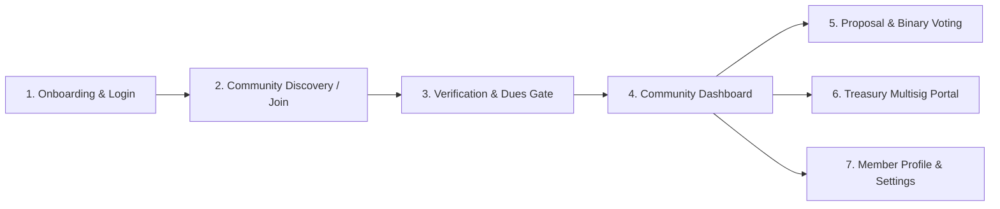

# Baraza Protocol — Frontend Integration Product Requirements Document (PRD)

**Target:** Web Application (`apps/web` / React 18 + Vite)  
**Lead Architect & Backend Engineer:** Simon Wandera  
**Date:** August 25, 2026  
**Document Status:** Approved Reference Specification for Frontend Implementation  

---

## 1. Executive Summary & Purpose
This PRD defines the complete user-facing product requirements, screens, state machines, and API integration boundaries for the Baraza Protocol client application. The frontend exists to present a seamless, jargon-free interface for community members and leaders across East Africa, hiding blockchain complexity behind invisible Privy MPC wallets while reliably consuming the hardened Vercel serverless backend.

---

## 2. Core User Journeys & UI Surfaces

---

## 3. Detailed Screen Requirements

### 3.1 Authentication & Invisible Wallet Onboarding
- **User Flow:** User enters Kenyan/East African mobile number (`+254...`) or email. Privy delivers a 6-digit SMS/Email OTP. Upon verification, Privy invisibly provisions a non-custodial MPC wallet keypair.
- **Frontend Requirements:**
  - Phone-auth toggle must default to **enabled** (`isPrivyPhoneAuthEnabled()`).
  - No seed phrase prompts or Web3 wallet connection modals displayed to regular members.
  - Display country code picker defaulting to Kenya (`+254`), Uganda (`+256`), Tanzania (`+255`), Rwanda (`+250`).

### 3.2 Community Creation & Dynamic Fee Configuration
- **User Flow:** Group founder creates a community by providing name, description, archetype (from the 27 supported types), and governance parameters.
- **Frontend Requirements:**
  - **Dynamic Activation Fee Input:** Founder specifies the activation fee amount (KES) or selects free/zero. **Never hardcode an activation amount.**
  - **Verification Tier Selector:**
    - Tier 1: Activation Amount (`activation_amount`)
    - Tier 2: Social Vouching (`vouching` — specify $N$ threshold)
    - Tier 3: Phone Verification (`phone`)
    - Tier 4: Proof of Personhood (`proof_of_personhood`)
  - **SACCO License Upload (If Community Type is SACCO/Co-op):**
    - Display statutory license number input and file upload (PDF/PNG) for SASRA/Ministry registration certificate.
    - Display warning notice: *"Regulated SACCO features (loans and capital mobilization) will remain gated until license verification is complete."*

### 3.3 Join Flow & Payment Gate (`JoinDao.tsx`)
- **User Flow:** Member follows invite link / enters join code (`join(community_id)`).
- **Frontend Requirements:**
  - Check `verification_tier` from `/api/communities`.
  - If Tier 1: Display dynamically calculated dues amount + 2% platform fee breakdown.
  - Provide payment rail options:
    1. **Mobile Money (Default):** Member enters M-Pesa number; frontend calls `POST /api/stellar/create-payment-intent`, shows *"Check your phone for the M-Pesa STK PIN prompt"*, and polls `POST /api/payment-orders/status` until `MEMBERSHIP_ACTIVE`.
    2. **Privy / Card / Crypto (Secondary):** Alternative path.
  - If Tier 2: Show vouch request status screen (*"Waiting for 2 member vouches"*).

### 3.4 Community Dashboard & Governance
- **Frontend Requirements:**
  - **Treasury Overview Card:** Total pooled funds in KES (converted from on-chain Stellar vault balance), recent contributions stream, and member count.
  - **Active Proposals List:** Filterable by *Active*, *Passed*, *Executed*, *Rejected*.
  - **Binary Voting Interface:**
    - Explicit **YES** (Vote For) / **NO** (Vote Against) buttons.
    - Real-time quorum indicator progress bar ($> 50\%$ required to pass).
    - Vote submission calls `POST /api/stellar/cast-vote` or direct chain adapter with clear optimistic pending state.

### 3.5 Treasury Multisig Portal (For Elected Officers)
- **Frontend Requirements:**
  - Display pending disbursement proposals requiring multisig signatures.
  - Show signer threshold status (e.g., *"2 of 3 Officers Approved"*).
  - Provide *"Approve Payout"* button that initiates on-chain signature verification.

### 3.6 Member Profile, Settings & Quality of Life
- **Frontend Requirements:**
  - View member contribution streak badge and verified badges.
  - Edit display name, notification preferences (SMS vs. WhatsApp).
  - Export personal contribution history to CSV / PDF receipt.

---

## 4. Design Aesthetics & Error Handling Guidelines
1. **Typography & Styling:** Clean, premium dark mode aesthetic with vibrant African sunrise accents (`#f97316` / `#e11d48`).
2. **Error Boundary Discipline:** Network errors must present localized, actionable Swahili/English recovery messages rather than raw API stack traces.
3. **No Secrets in Frontend:** The client bundle must never reference or expose private service keys. All server interactions pass through `/api/*` endpoints.
