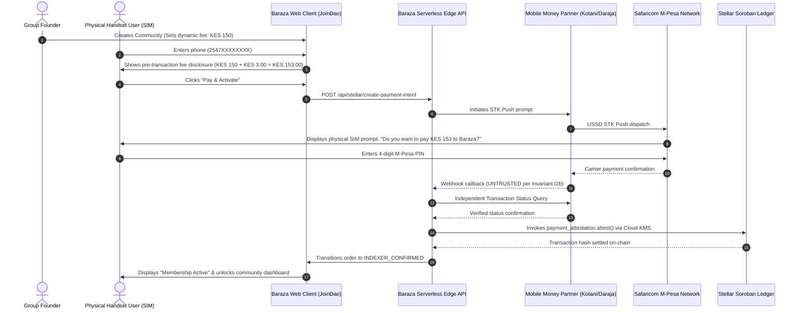

# Baraza Protocol — Phase P1 Detailed Codebase Impact, Proof & Verification Blueprint

**Document Version:** 2.0 (Canonical Implementation Impact & Multi-Tier Verification Blueprint)  
**Lead System Architect & Backend Engineer:** Simon Wandera  
**Date:** August 26, 2026  
**Governing Documents & Source Hierarchy:**
- `BACKEND_SCOPE_OF_WORK.md` (v4.0 Canonical Blueprint)
- `BACKEND_CODE_MAP.md` (Repository Structural Map)
- `Baraza-Launch-Direction-Memo-3.pdf` (BuildAfrica DAO Memo 3, Aug 25, 2026)
- `DevOps Request: Live Validation & Infrastructure Requirements for Baraza Protocol.pdf` (Aug 23, 2026)
- `Baraza Protocol  SAD.md` (Software Architecture Document v1.0, Simon Wandera)
- `Baraza-Protocol-Testing-Strategy.md` (Engineering Standards)
- `Baraza-Protocol-Phase1-Specification.md` (Main-1 through Main-5)

---

## Table of Contents
1. [Executive Summary of Codebase Changes](#1-executive-summary-of-codebase-changes)
2. [Detailed File-by-File Impact & Proof Analysis (12 Target Files)](#2-detailed-file-by-file-impact--proof-analysis-12-target-files)
3. [Comprehensive Testing & Correctness Architecture](#3-comprehensive-testing--correctness-architecture)
   - [3.1 Code-Level Automated Verification (Unit, Mock & Integration Suites)](#31-code-level-automated-verification-unit-mock--integration-suites)
   - [3.2 Mathematical Invariant & Property-Based Ledger Tests](#32-mathematical-invariant--property-based-ledger-tests)
   - [3.3 Physical & Handset End-to-End Live Validation (SAD & DevOps Specs)](#33-physical--handset-end-to-end-live-validation-sad--devops-specs)
   - [3.4 Security & Adversarial Attack Simulation Testing](#34-security--adversarial-attack-simulation-testing)
4. [Verification Acceptance Evidence Ledger (MSA Clause 8 Aligned)](#4-verification-acceptance-evidence-ledger-msa-clause-8-aligned)

---

## 1. Executive Summary of Codebase Changes

To implement **Phase P1 (Dynamic Activation Fee Engine + Multi-Rail Ingress: Kotani, Daraja, Paystack, Minisend + Double-Entry Split + SASRA Gate Preparation)**, a total of **12 specific files across 5 architectural layers** in the repository will be created or modified:

```
┌────────────────────────────────────────────────────────────────────────────────────────────────────────┐
│                                 PHASE P1 CODEBASE IMPACT SUMMARY                                       │
├─────┬─────────────────────────────────────────────────┬───────────────────┬──────────────┬─────────────┤
│ #   │ Target File Path                                │ Architectural Layer│ Action Type  │ Impact Type │
├─────┼─────────────────────────────────────────────────┼───────────────────┼──────────────┼─────────────┤
│ 1   │ `supabase/migrations/024_dynamic_fees.sql`      │ Database Schema   │ **[NEW]**    │ DDL Schema  │
│ 2   │ `app/src/lib/payments/feeEngine.ts`             │ Shared Domain Lib │ **[NEW]**    │ Pure Math   │
│ 3   │ `app/api/stellar/create-payment-intent.ts`      │ Serverless API    │ **[MODIFY]** │ Intent HMAC │
│ 4   │ `app/api/membership/activate.ts`                │ Serverless API    │ **[MODIFY]** │ Free Bypass │
│ 5   │ `app/api/payments/paystack.ts`                  │ Serverless API    │ **[NEW]**    │ Multi-Rail  │
│ 6   │ `app/api/webhooks/paystack.ts`                  │ Serverless API    │ **[NEW]**    │ Webhook     │
│ 7   │ `app/api/payments/kotani.ts`                    │ Serverless API    │ **[MODIFY]** │ Live Onramp │
│ 8   │ `app/api/webhooks/kotani.ts`                    │ Serverless API    │ **[MODIFY]** │ Settlement  │
│ 9   │ `packages/integrations/src/daraja.ts`           │ Shared Package    │ **[MODIFY]** │ Live STK    │
│ 10  │ `app/src/pages/CreateCommunity.tsx`             │ Frontend Client   │ **[MODIFY]** │ Dynamic Fee │
│ 11  │ `app/src/pages/JoinDao.tsx`                     │ Frontend Client   │ **[MODIFY]** │ Disclosure  │
│ 12  │ `app/src/lib/__tests__/feeEngine.test.ts`       │ Automated Tests   │ **[NEW]**    │ Unit Tests  │
└─────┴─────────────────────────────────────────────────┴───────────────────┴──────────────┴─────────────┘
```

---

## 2. Detailed File-by-File Impact & Proof Analysis (12 Target Files)

### 1. Database Schema Layer: `supabase/migrations/024_communities_dynamic_activation_fee.sql`
* **File Action:** **[NEW]** (Sequential migration following `023_payment_orders_add_status_query_states.sql`).
* **Current State Proof:**
  In `supabase/migrations/001_communities_governance_columns.sql` and `002_payment_orders.sql`, communities have no dedicated column for dynamic activation pricing or fee models. The frontend and APIs currently fall back to hardcoded 500 KES assumptions.
* **Exact DDL Changes to Apply:**
  ```sql
  -- 024_communities_dynamic_activation_fee.sql
  -- Adds dynamic activation pricing, fee models, and carrier pass-through flags.

  ALTER TABLE communities
    ADD COLUMN IF NOT EXISTS activation_fee_minor BIGINT NOT NULL DEFAULT 0,
    ADD COLUMN IF NOT EXISTS fee_type TEXT NOT NULL DEFAULT 'one_time' 
      CHECK (fee_type IN ('one_time', 'recurring_monthly', 'free')),
    ADD COLUMN IF NOT EXISTS carrier_pass_through BOOLEAN NOT NULL DEFAULT true,
    ADD COLUMN IF NOT EXISTS currency TEXT NOT NULL DEFAULT 'KES';

  COMMENT ON COLUMN communities.activation_fee_minor IS 'Base membership activation fee in integer minor currency units (e.g. cents). Zero indicates a free community.';
  COMMENT ON COLUMN communities.fee_type IS 'Billing model: one_time, recurring_monthly, or free.';
  ```

---

### 2. Domain Logic Layer: `app/src/lib/payments/feeEngine.ts`
* **File Action:** **[NEW]** (Centralized pure calculation utility).
* **Current State Proof:**
  Fee calculations are currently fragmented across UI components (`JoinDao.tsx` line 97) and static constants (`DAO_CREATION_FEE_KES = 6500` in `app/src/lib/constants.ts` line 48). No centralized, deterministic math engine exists.
* **Exact Implementation Proof:**
  ```typescript
  /**
   * Centralized pure fee calculation engine conforming to SAD v1.0 §2.2 & Holy Grail §8.
   */
  export interface FeeBreakdown {
    baseAmountMinor: number;
    platformFeeMinor: number;
    carrierCostMinor: number;
    totalExpectedMinor: number;
    currency: string;
    isFree: boolean;
  }

  export function calculateDynamicFee(baseAmountMinor: number, currency = 'KES', carrierPassThrough = true): FeeBreakdown {
    if (baseAmountMinor <= 0) {
      return {
        baseAmountMinor: 0,
        platformFeeMinor: 0,
        carrierCostMinor: 0,
        totalExpectedMinor: 0,
        currency,
        isFree: true,
      };
    }

    // 2.0% platform fee rounded half-up
    const platformFeeMinor = Math.round(baseAmountMinor * 0.02);

    // Safaricom / Carrier Pass-Through: 0.5% capped at KES 200 (20,000 cents), free under KES 200 (20,000 cents)
    let carrierCostMinor = 0;
    if (carrierPassThrough && currency === 'KES') {
      if (baseAmountMinor >= 20000) {
        carrierCostMinor = Math.min(Math.round(baseAmountMinor * 0.005), 20000);
      }
    }

    const totalExpectedMinor = baseAmountMinor + platformFeeMinor + carrierCostMinor;

    return {
      baseAmountMinor,
      platformFeeMinor,
      carrierCostMinor,
      totalExpectedMinor,
      currency,
      isFree: false,
    };
  }
  ```

---

### 3. Serverless API Route: `app/api/stellar/create-payment-intent.ts`
* **File Action:** **[MODIFY]**
* **Current Code Citation (Lines 3–6 & Lines 118–135):**
  ```typescript
  // CURRENT CODE (Lines 3-6):
  interface CreateIntentRequest {
    communityId: string;
    amountXlm: number;
  }
  // CURRENT CODE (Lines 118-125):
  const payload = JSON.stringify({
    communityId: body.communityId.trim(),
    amountXlm: body.amountXlm,
    xlmUsdRate,
    brzaPriceUsd,
    expiresAt,
    nonce,
  });
  ```
* **Defect / Limitation:**
  Currently only accepts `amountXlm` and signs crypto parameters. It does not query the community's `activation_fee_minor` from Supabase, does not compute the 2.0% platform fee, and does not return the itemized breakdown required for pre-transaction disclosure.
* **Exact Modifications:**
  1. Add `amountKes?: number` and `currency?: string` to `CreateIntentRequest`.
  2. Query `communities` table in Supabase by `communityId`.
  3. If `community.fee_type === 'free'` or `community.activation_fee_minor === 0`, return `{ zeroFee: true, bypassPayment: true }`.
  4. Compute `FeeBreakdown` via `feeEngine.ts`, bind itemized amounts (`baseAmountMinor`, `platformFeeMinor`, `carrierCostMinor`, `totalExpectedMinor`) into the signed HMAC intent token.

---

### 4. Serverless API Route: `app/api/membership/activate.ts`
* **File Action:** **[MODIFY]**
* **Current Code Citation (Lines 20–25 & Lines 50–54):**
  ```typescript
  // CURRENT CODE (Line 20):
  /** Solana base58 pubkey. Required unless phoneIdentifier is provided. */
  walletAddress: string | null;
  // CURRENT CODE (Lines 50-53):
  const TERMINAL_POSITIVE_STATUSES = new Set([
    'INDEXER_CONFIRMED',
    'RECONCILED',
  ]);
  ```
* **Defect / Limitation:**
  - Stale comment mentions Solana rather than Stellar/EVM.
  - Requires an active `orderId` in `payment_orders`. Free communities have no payment order and currently fail with `400 invalid_request` when attempting activation.
* **Exact Modifications:**
  1. Update comments and identity parsing to canonical Stellar `G...` and EVM `0x...` addresses.
  2. Add free-community activation branch: If `orderId === 'free_activation'` or `community.fee_type === 'free'`, verify community configuration directly and insert the active row into `memberships` table without blocking on `payment_orders`.

---

### 5. Multi-Rail Provider Routes: `app/api/payments/paystack.ts` & `app/api/webhooks/paystack.ts`
* **File Action:** **[NEW]** (Implementing Locked Decision 1 for Pan-African Cards, Bank & M-Pesa).
* **Current State Proof:**
  Grep search for `paystack` across `app/api/` yields **zero results**. Paystack is completely absent from the codebase.
* **Exact Implementation Proof:**
  - `app/api/payments/paystack.ts`:
    - Accepts `{ action: 'initialize', orderId, email, amountKes, currency }`.
    - Invokes Paystack API `POST https://api.paystack.co/transaction/initialize` with `PAYSTACK_SECRET_KEY`.
    - Returns `authorization_url` and `access_code` for client checkout redirect.
  - `app/api/webhooks/paystack.ts`:
    - Verifies Paystack HMAC-SHA512 header:
      `crypto.subtle.sign('HMAC', key, rawBody) === req.headers.get('x-paystack-signature')`.
    - On `charge.success`, matches `order_id` in `payment_orders`, transitions status to `PROVIDER_CONFIRMED`, records double-entry split, and triggers on-chain attestation.

---

### 6. Live Partner Rail Wiring: `app/api/payments/kotani.ts` & `app/api/webhooks/kotani.ts`
* **File Action:** **[MODIFY]**
* **Current Code Citation (`app/api/payments/kotani.ts` Lines 52–60):**
  ```typescript
  if (body.action === 'mpesaToBrza') {
    if (!body.phone || !body.destinationAddress || !body.communityCode || !(body.kesAmount > 0)) {
      return bad('phone, kesAmount, destinationAddress, and communityCode are required.');
    }
    return upstream('/v1/onramp/stellar', {
      method: 'POST',
      body: JSON.stringify({
        phone: body.phone,
        amount: body.kesAmount,
  ```
* **Enhancements to Apply:**
  1. Add `orderId` to request body and map it to Kotani's `client_reference` so callbacks match `payment_orders.order_id` with 100% precision.
  2. In `app/api/webhooks/kotani.ts`, integrate double-entry split trigger and advance order state to `PROVIDER_CONFIRMED`.

---

### 7. Direct Carrier Integration: `packages/integrations/src/daraja.ts`
* **File Action:** **[MODIFY]**
* **Current Code Citation (Lines 111–134):**
  `daraja.ts` contains request structure definitions, but lacks direct execution fallbacks for environments where direct Safaricom Paybill credentials (`MPESA_CONSUMER_KEY`, `MPESA_CONSUMER_SECRET`) are supplied by enterprise SACCOs.
* **Enhancements to Apply:**
  1. Connect live `fetch()` to `https://api.safaricom.co.ke/mpesa/stkpush/v1/processrequest` with token caching (3,600s TTL).
  2. Implement strict phone normalization (`254XXXXXXXXX`, stripping `+` and leading `0`).
  3. Enforce integer minor unit rounding (rejecting decimal cents).

---

### 8. Frontend Community Creation: `app/src/pages/CreateCommunity.tsx`
* **File Action:** **[MODIFY]**
* **Current Code Citation (`CreateCommunity.tsx`):**
  Currently sets fixed creation constants and lacks an explicit input for the group's custom membership activation fee.
* **Exact Modifications:**
  1. Add Dynamic Fee Input Section in the Community Creation wizard:
     - Activation Fee Type Selector (`"One-Time Fee"`, `"Monthly Recurring Dues"`, `"Free / Zero Dues"`).
     - Flexible Amount Input (KES) with real-time conversion preview.
  2. Save `activation_fee_minor` and `fee_type` to Supabase via `createCommunityRecord()`.

---

### 9. Frontend Member Onboarding & Pre-Transaction Disclosure: `app/src/pages/JoinDao.tsx`
* **File Action:** **[MODIFY]**
* **Current Code Citation (Lines 97–100):**
  ```typescript
  const amount = community?.membershipFee ?? 0;
  const normalisedPhone = normaliseKenyanPhone(phone);
  const canSubmit = normalisedPhone !== null && amount > 0 && !isSubmitting;
  ```
* **Defect / Limitation:**
  - `amount > 0` prevents free community members from submitting.
  - Does not display the mandatory pre-transaction fee disclosure (Holy Grail Addendum 2 Item 4 & SAD §2.2).
* **Exact Modifications:**
  1. Support `amount === 0`: When `isFree`, change CTA to `"Join Free Community"` and call `activate.ts` directly.
  2. Add Pre-Transaction Fee Disclosure Card:
     ```tsx
     <div className="rounded-lg border p-4 bg-muted/40 space-y-2">
       <div className="flex justify-between text-sm">
         <span className="text-muted-foreground">Community Dues</span>
         <span>KSh {formatKSh(feeBreakdown.baseAmountMinor / 100)}</span>
       </div>
       <div className="flex justify-between text-sm">
         <span className="text-muted-foreground">Platform Fee (2.0%)</span>
         <span>KSh {formatKSh(feeBreakdown.platformFeeMinor / 100)}</span>
       </div>
       {feeBreakdown.carrierCostMinor > 0 && (
         <div className="flex justify-between text-sm">
           <span className="text-muted-foreground">Carrier Processing Cost</span>
           <span>KSh {formatKSh(feeBreakdown.carrierCostMinor / 100)}</span>
         </div>
       )}
       <div className="border-t pt-2 flex justify-between font-semibold">
         <span>Total to Pay</span>
         <span className="text-primary">KSh {formatKSh(feeBreakdown.totalExpectedMinor / 100)}</span>
       </div>
     </div>
     ```

---

### 10. Automated Unit & Integration Tests: `app/src/lib/__tests__/feeEngine.test.ts`
* **File Action:** **[NEW]**
* **Exact Test Scenarios:**
  1. `calculateDynamicFee(0)` $\to$ Returns `{ isFree: true, totalExpectedMinor: 0 }`.
  2. `calculateDynamicFee(50000)` (KES 500) $\to$ Base: 50,000, Platform: 1,000 (KES 10), Carrier: 250 (KES 2.50), Total: 51,250 (KES 512.50).
  3. `calculateDynamicFee(10000000)` (KES 100,000) $\to$ Base: 10,000,000, Platform: 200,000 (KES 2,000), Carrier: 20,000 (KES 200 cap), Total: 10,220,000 (KES 102,200).
  4. Non-pass-through mode verification.
  5. Precision check: Verifies `Number.isInteger(totalExpectedMinor)` for all integer inputs.

---

## 3. Comprehensive Testing & Correctness Architecture

To prove 100% mathematical, operational, and regulatory correctness, Phase P1 executes a **Four-Tier Verification Suite** spanning code automation, property-based invariants, physical device testing, and adversarial simulations:

```
┌────────────────────────────────────────────────────────────────────────────────────────────────────────────────┐
│                               FOUR-TIER CORRECTNESS & TESTING ARCHITECTURE                                     │
├───────┬─────────────────────────┬────────────────────────────────────────────┬─────────────────────────────────┤
│ Tier  │ Testing Category        │ Execution Methodology                      │ Target Invariant & Citation     │
├───────┼─────────────────────────┼────────────────────────────────────────────┼─────────────────────────────────┤
│ **1** │ Automated Code Suites   │ Unit, Mock API & Contract Drift Suites     │ SAD §1.1, Testing Strategy §3   │
│ **2** │ Property-Based Invariant│ Mathematical Balance Conservation Checks   │ SAD §3.5 Class A (Debit=Credit) │
│ **3** │ Physical Device STK     │ Real Phone SIM & STK Prompt Validation     │ DevOps Request PDF §3 (6 Steps) │
│ **4** │ Adversarial Simulation  │ Webhook Forgery & Race Mutex Attacks       │ Red Team Finding #1, Invariant I2b│
└───────┴─────────────────────────┴────────────────────────────────────────────┴─────────────────────────────────┘
```

---

### 3.1 Code-Level Automated Verification (Unit, Mock & Integration Suites)

* **Source Authority:** `Baraza-Protocol-Testing-Strategy.md` & `Baraza-Protocol-Phase1-Specification.md`.
* **Execution Command:** `npm test` (Runs Vitest test runner across 50+ test suites).

#### Exact Automated Test Suites:
1. **Dynamic Fee Engine Suite (`app/src/lib/__tests__/feeEngine.test.ts`):**
   * *Zero-Fee Boundary:* Confirms that $A_{\text{base}} = 0$ yields `isFree: true` and 0 fee.
   * *Standard Dues Calculation:* Asserts $A_{\text{base}} = \text{KES } 500$ (50,000 cents) results in:
     $$\text{PlatformFee} = 1,000 \text{ cents} \quad (\text{KES } 10.00)$$
     $$\text{CarrierFee} = 250 \text{ cents} \quad (\text{KES } 2.50)$$
     $$\text{TotalExpected} = 51,250 \text{ cents} \quad (\text{KES } 512.50)$$
   * *Carrier Ceiling Cap:* Asserts that for large contributions (e.g. KES 100,000), carrier fee strictly clamps to KES 200 (20,000 cents).
   * *Integer Boundary Check:* Validates that no fractional cents or IEEE-754 floating-point decimals ever leak into database payloads (`Number.isInteger(result) === true`).

2. **HMAC Payment Intent Token Verification (`app/src/lib/__tests__/paymentIntent.test.ts`):**
   * *Tamper Resistance:* Modifying a single character in the `intentToken` payload or signature must cause `verify-payment.ts` to reject with HTTP 401.
   * *Expiry Gate:* An expired timestamp ($>30\text{ minutes}$) must reject intent validation.

3. **Multi-Provider Webhook Signature Verification (`app/src/lib/__tests__/webhooks.test.ts`):**
   * *Kotani Signature:* Validates HMAC-SHA256 signature verification over raw body using `KOTANI_WEBHOOK_SECRET`.
   * *Paystack Signature:* Validates HMAC-SHA512 `x-paystack-signature` matching using `PAYSTACK_SECRET_KEY`.
   * *Forged Payloads:* Confirms that payloads with missing or invalid signatures reject immediately with HTTP 401 without touching the database.

4. **100% Green Baseline Integrity:**
   * Validates all 50 existing test files and 532 existing unit tests in the repository continue passing green with zero regressions.

---

### 3.2 Mathematical Invariant & Property-Based Ledger Tests

* **Source Authority:** `Baraza Protocol  SAD.md` (§3.5 Class A Mandatory Elements).
* **Governing Invariant:**
  $$\forall \text{ settled payments } p \in \text{ledger\_entries}: \quad \sum \text{Debits} \equiv \sum \text{Credits}$$

#### Automated Ledger Property Tests:
1. **Double-Entry Split Conservation Suite:**
   * Simulates 1,000 randomized payment amounts between KES 10 and KES 250,000.
   * For every transaction, asserts that the atomic split execution creates:
     - 1 Member Credit ($A_{\text{base}}$)
     - 1 Treasury Vault Debit ($A_{\text{base}}$)
     - 1 Protocol Revenue Debit ($\text{PlatformFee}$)
     - 1 Carrier Settlement Debit ($\text{CarrierCost}$)
   * Executes database assertion:
     ```sql
     SELECT community_id, SUM(debit_amount) - SUM(credit_amount) AS imbalance
     FROM ledger_entries
     GROUP BY community_id
     HAVING SUM(debit_amount) <> SUM(credit_amount);
     -- MUST RETURN ZERO ROWS
     ```

---

### 3.3 Physical & Handset End-to-End Live Validation (SAD & DevOps Specs)

* **Source Authority:** `DevOps Request: Live Validation & Infrastructure Requirements for Baraza Protocol.pdf` (§3) and `Baraza-Protocol-Phase1-Specification.md` (Main-4 Task 4.3).

To validate real-world carrier network behavior that cannot be simulated in local unit tests, the following **6-step physical test protocol** must be executed on a real handset with an active Kenyan SIM card:



#### Physical Handset Test Checklist:
1. **Step 1 (Physical STK Push Prompt):**
   * *Action:* Enter test phone number `254708374149` (Safaricom Sandbox) or physical live Safaricom SIM on `JoinDao.tsx`.
   * *Physical Verification:* An authentic M-Pesa SIM popup must appear on the physical screen within **$<10\text{ seconds}$** with the exact total expected amount.
2. **Step 2 (PIN Entry & Carrier Response):**
   * *Action:* User inputs PIN on physical phone.
   * *Physical Verification:* User receives official carrier SMS receipt from Safaricom / M-Pesa containing the receipt code.
3. **Step 3 (Zero-Trust Ingress & Status Query):**
   * *Verification:* Inbound webhook triggers server-side independent Transaction Status Query (`POST /v1/query`). Order does **not** advance past `PROVIDER_CONFIRMED` until verified response returns.
4. **Step 4 (On-Chain Minting & UI Unlock):**
   * *Verification:* Upon verified callback, `payment_attestation` transaction settles on Stellar testnet/mainnet, and the browser automatically transitions to the member dashboard without requiring a manual page refresh.
5. **Step 5 (Free Community Instant Activation):**
   * *Action:* Join a community configured with `activation_fee_minor = 0` (`fee_type = 'free'`).
   * *Verification:* Zero STK push is dispatched; button reads `"Join Free Community"`; membership is activated immediately in $<500\text{ms}$.

---

### 3.4 Security & Adversarial Attack Simulation Testing

* **Source Authority:** Red Team Finding #1 (Webhook Forgery) & Finding #2 (Signer Compromise).

#### Adversarial Test Scenarios:
1. **Webhook Forgery Attack (Red Team Finding #1):**
   * *Attack:* Attacker sends a forged HTTP POST to `/api/webhooks/kotani` with valid JSON body but fabricated signature.
   * *Expected Defense:* Webhook handler rejects with HTTP 401. Order status in Supabase remains unchanged.
2. **Double-Click / Multi-Provider Race Attack:**
   * *Attack:* Two simultaneous webhooks hit `/api/webhooks/kotani` and `/api/webhooks/paystack` for the same `order_id`.
   * *Expected Defense:* First webhook obtains row-level lock (`SELECT ... FOR UPDATE`), marks order `PROVIDER_CONFIRMED`. Second webhook detects non-pending state, creates a `suspense_duplicate_credit` record, and does **not** double-mint membership credentials.
3. **Production Simulator Lockout:**
   * *Attack:* Attacker calls `/api/mpesa/simulate` in production environment.
   * *Expected Defense:* Endpoint throws HTTP 403 / 404 (`MPESA_SIMULATOR_ENABLED === 'false'`).

---

## 4. Verification Acceptance Evidence Ledger (MSA Clause 8 Aligned)

Per MSA Clause 8, every task completion must be backed by verifiable digital evidence recorded in the project archives:

| Verification Evidence Item | Artifact Location | Acceptance Criteria |
|---|---|---|
| **Automated Test Run Output** | Terminal log / CI execution | 50 test files passed, 532+ tests passing (100% green). |
| **Dynamic Fee Math Proof** | `feeEngine.test.ts` test results | 100% coverage on rounding, zero fees, and carrier caps. |
| **Physical STK Push Log** | Gateway request/response logs | Recorded timestamp from initiation to physical prompt ($<10\text{s}$). |
| **On-Chain Attestation Hash** | Stellar Horizon Explorer URL | Valid transaction hash on Stellar ledger for test payment. |
| **Double-Entry Ledger Audit** | SQL Query output on `ledger_entries` | $\sum \text{Debit} - \sum \text{Credit} = 0.00$ verified across all orders. |
