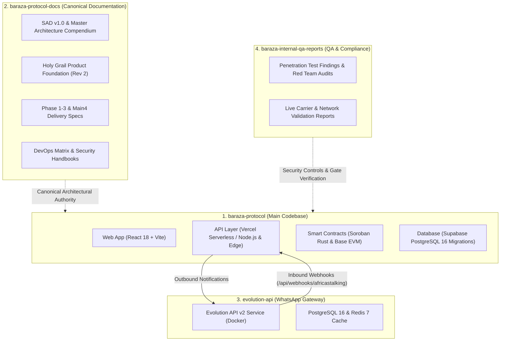
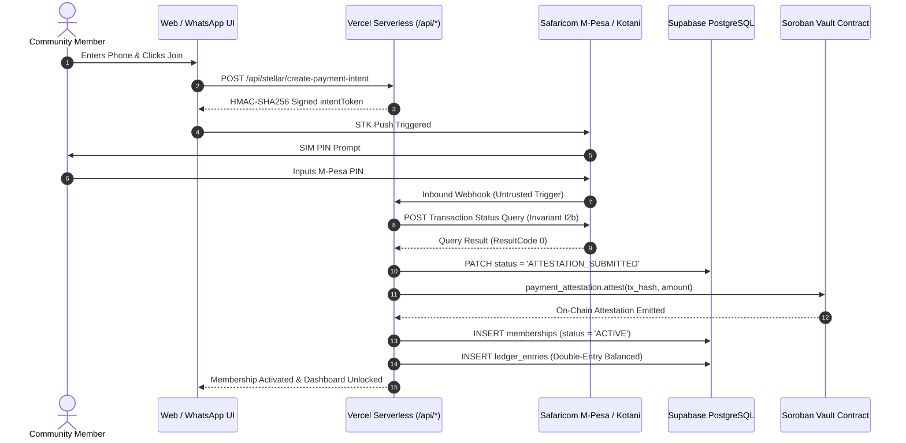

# Baraza Protocol — Developer Onboarding & Ecosystem Guide

**Non-Custodial Operating System & Governance Infrastructure for African Community Capital**  
**Lead System Architect & Backend Engineer:** Simon Wandera  
**Repository:** `Build-Africa-DAO/baraza-protocol`  
**Default Branch:** `main` (Active Work: `test-plan`)  

---

## 🧭 Welcome Incoming Engineers

**Baraza Protocol** is a sovereign, non-custodial operating system designed for collective capital, mutual-aid groups, rotating credit associations (*chamas*), savings cooperatives (*SACCOs*), and investment syndicates across East Africa. It provides mobile money integration (M-Pesa, Kotani Pay, Minisend), invisible embedded cryptographic wallets (Privy MPC), on-chain governance, and multi-sig treasury management without forcing Web3 jargon onto everyday members.

This guide provides everything you need to understand the multi-repository ecosystem, run the codebase locally, understand the data flows, and navigate the active Scope of Work.

---

## 🌐 1. Multi-Repository Ecosystem Topology

The Baraza platform is partitioned across dedicated repositories to separate core code, canonical specifications, messaging infrastructure, and security reports:



### Repository Summary & Links:
1. **`baraza-protocol` (This Repository):**
   - Main monorepo containing smart contracts (`contracts/`), web frontend (`app/`), serverless API routes (`app/api/`), and database migrations (`supabase/migrations/`).
2. **`baraza-protocol-docs` ([GitHub: Build-Africa-DAO/baraza-protocol-docs](https://github.com/Build-Africa-DAO/baraza-protocol-docs)):**
   - Canonical single source of truth for protocol architecture, SAD v1.0, Holy Grail PRDs, and deployment runbooks.
3. **`evolution-api`:**
   - Dockerized WhatsApp conversational messaging engine proxying natural language turns to the Baraza Bot FSM.
4. **`baraza-internal-qa-reports`:**
   - Private repository archiving audit logs, Red Team vulnerability disclosures, and carrier compliance certificates.

---

## ⚡ 2. Core Execution Deliverables (In This Repository)

Before writing code, familiarize yourself with the three canonical execution blueprints located at the root of this repository:

| Document | Purpose & Content | Target Audience |
| :--- | :--- | :--- |
| 🗺️ **[`BACKEND_CODE_MAP.md`](./BACKEND_CODE_MAP.md)** | **Exhaustive Code & Logic Ledger:** File-by-file inventory, exact Rust/Solidity data structs, functions, panic rules, 26 API route specs, and database tables touched. | Backend, Smart Contract & Fullstack Devs |
| 📋 **[`BACKEND_SCOPE_OF_WORK.md`](./BACKEND_SCOPE_OF_WORK.md)** | **SAD-Aligned Master Execution Plan:** Gap analysis, percentage completion per subsystem, missing logic, standard production SaaS API endpoints, and system proposals. | Tech Leads, Backend Engineers & PMs |
| 📱 **[`FRONTEND_INTEGRATION_PRD.md`](./FRONTEND_INTEGRATION_PRD.md)** | **Client Product Requirements:** Screen-by-screen specifications for invisible wallet onboarding, dynamic fee calculations, voting UI, and workspace features. | Frontend & Mobile Engineers |

---

## 🔄 3. How Subsystems Connect (End-to-End Execution Flows)

### Flow A: Mobile Money Ingress & On-Chain Settlement


### Flow B: Non-Custodial Invisible Identity
1. **Phone Onboarding:** Member inputs mobile number (`+254...`).
2. **Cryptographic Identity:** Number is normalized and hashed with `PAYMENT_PHONE_HASH_PEPPER` via HMAC-SHA256 (no raw PII stored on-chain, compliant with Kenya DPA 2019).
3. **Privy MPC Key Provisioning:** Privy silently provisions a non-custodial wallet tied to the user's verified phone session.

---

## 🚀 4. Local Development Quickstart

### Prerequisites
- **Node.js:** v20.x or higher (`node -v`)
- **Package Manager:** npm v10+
- **Rust & Cargo:** v1.75+ (for smart contract builds)
- **Soroban CLI:** v20+ (`cargo install --locked soroban-cli`)
- **Docker & Compose:** (for local Evolution API & PostgreSQL testing)

### Setup Steps
```bash
# 1. Clone the repository
git clone https://github.com/Build-Africa-DAO/baraza-protocol.git
cd baraza-protocol

# 2. Install dependencies
cd app
npm install

# 3. Configure environment variables
cp .env.example .env.local
# Set your SUPABASE_URL, SUPABASE_SERVICE_ROLE_KEY, STELLAR_INTENT_SECRET, etc.

# 4. Run full automated test suite
npm test

# 5. Start local frontend development server
npm run dev
```

---

## 📊 5. Scope of Work & Roadmap Summary

Below is an executive overview of active development phases. For exhaustive task breakdowns, exact mathematical formulas, and missing line specifications, consult [`BACKEND_SCOPE_OF_WORK.md`](./BACKEND_SCOPE_OF_WORK.md).

```
┌────────────────────────────────────────────────────────────────────────────────────────────────────────┐
│                                   BARAZA ACTIVE EXECUTION ROADMAP                                      │
├─────────┬──────────────────────────────────────────┬────────────────┬───────────────┬──────────────────┤
│ Phase   │ Subsystem & Core Deliverables            │ Classification │ Current State │ Canonical Detail │
├─────────┼──────────────────────────────────────────┼────────────────┼───────────────┼──────────────────┤
│ **P1**  │ Dynamic Fee Engine + Kotani/Minisend     │ `[SAD-ALIGNED]`│ 40% Complete  │ SOW §B.1, §B.2   │
│ **P2**  │ SASRA SACCO License Verification Gate    │ `[SAD-ALIGNED]`│ 20% Complete  │ SOW §D.1, §D.2   │
│ **P3**  │ Soroban Mainnet Deploy + 2-of-N Attest   │ `[SAD-ALIGNED]`│ 90% Complete  │ SOW §A.1, §A.2   │
│ **P4**  │ Double-Entry Ledger + Cron Reconciler    │ `[SAD-ALIGNED]`│ 60% Complete  │ SOW §C.1, §F.1   │
│ **P5**  │ Core SaaS: Profile, Push, Settings       │ `[PROPOSED]`   │ 30% Complete  │ SOW §G.1, §G.2   │
│ **P6**  │ Workspace: Roadmap, Suggestions, Bounties│ `[PROPOSED]`   │ 20% Complete  │ SOW §G.3, §G.4   │
│ **P7**  │ Health, Observability, Rate Limiting     │ `[PROPOSED]`   │ 25% Complete  │ SOW §G.7, §G.8   │
│ **P8**  │ Event Indexer + KMS HSM Key Custody      │ `[PROPOSED]`   │ 10% Complete  │ SOW §H.1, §H.3   │
└─────────┴──────────────────────────────────────────┴────────────────┴───────────────┴──────────────────┘
```

---

## 🛡️ 6. Engineering Invariants & Coding Rules

All contributors must adhere to the governing engineering invariants established in SAD v1.0:

1. **Canonical Truth on Chain (ADR-002, ADR-003):** Stellar Soroban contracts are the sole authoritative truth for group registry, membership lists, proposals, and vault balances. PostgreSQL is strictly an index/cache.
2. **Single-Chain Per Community (ADR-001):** A community resides entirely on Stellar Soroban (or Base EVM for Tier 4 DAOs). No cross-chain state mixing.
3. **Mathematical Balance Conservation (SAD §3.5):** Every financial transaction must satisfy $\sum \text{Debit} \equiv \sum \text{Credit}$ in `ledger_entries`.
4. **Zero-Trust Carrier Ingress (Invariant I3a):** Inbound webhooks from mobile money providers are treated as untrusted hints. State transitions to `ATTESTATION_SUBMITTED` require an independent status query verification (Invariant I2b).
5. **Privacy Protection (Kenya DPA 2019):** Raw phone numbers must never be committed to source control or stored in on-chain storage. Always use HMAC-SHA256 peppered hashes.

---

## 🤝 7. Getting Help & Contributing

- **Technical Inquiries:** Simon Wandera (Lead System Architect & Backend Engineer)
- **Documentation Repo:** [github.com/Build-Africa-DAO/baraza-protocol-docs](https://github.com/Build-Africa-DAO/baraza-protocol-docs)
- **Contributing:** Branch off `main` or `test-plan` using descriptive branch names (`feat/...`, `fix/...`), ensure `npm test` passes with 100% green tests, and link your PR to the corresponding section in [`BACKEND_SCOPE_OF_WORK.md`](./BACKEND_SCOPE_OF_WORK.md).
